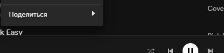

## Основные страницы
- [Проекты](https://script.google.com/home/my) - перечень проектов на вашем аккаунте, при выборе проекта открывается _редактор кода_
- [Выполнения](https://script.google.com/home/executions) - содержит список с _результатами_ выполненных функций
- [Триггеры](https://script.google.com/home/triggers) - расписание для выполнения функций

## Создание плейлиста

Выполним следующую задачу: 
- возьмем треки из плейлистов `микс дня`
- удалим из них любимые треки (лайки)
- добавим рекомендации
- создадим плейлист
- зададим расписание (триггер)

1. Откройте файл `main` в _редакторе кода_ и вставьте в него следующий код и __сохраните__ (иконка дискеты или Ctrl + S):
```js
function createFirstPlaylist() {
    // 1 - собираем
    let mixTracks = Source.getTracks([
        { name: 'Микс дня 1', id: 'вашеId' },
        { name: 'Микс дня 2', id: 'вашеId' },
    ]);
    let recomTracks = Source.craftTracks(mixTracks);
    let savedTracks = Source.getSavedTracks();   

    // 2 - обрабатываем
    Combiner.push(mixTracks, recomTracks);   
    Filter.removeTracks(mixTracks, savedTracks);
    Selector.keepRandom(mixTracks, 20);
    
    // 3 - создаем плейлист
    Playlist.saveWithReplace({
        // id: 'вашеId',
        name: 'Первый плейлист',
        tracks: mixTracks,
        randomCover: 'update',
    });
}
```

2. Логическая структура кода состоит из трех блоков. Сначала запрашиваются треки. Затем над ними проводятся операции. И наконец команда создать плейлист с получившимся набором треков.
   
   Воспринимайте каждую строчку как команду к действию что-то сделать. Такие команды называют _функцией_. Функцию можно _определить_ (создать) и _вызвать_. То есть задать алгоритм и выполнить по нашему запросу. В данном случае, создается функция `createFirstPlaylist`, которая внутри себя вызывает функции библиотеки Goofy. Совокупность команд (вызовов функций), образует код.

   Чтобы понимать что делает код, просто читайте его как книжку. У каждого слова есть определение в словаре. Так и здесь, у каждой функции есть описание того, что она делает. Зачастую основной смысл передает само имя функции. Поэтому знание английского или использование переводчика во многом поможет. Однако всегда есть нюансы: что передать в функцию, что она сделает, что вернет?

   Описание функций доступно в _списке функций_. К примеру, найдем описание функции `Source.getTracks`. В левом меню нажмите правой кнопкой мыши на пункт `список функций` и откройте страницу в новой вкладке. Перейдите на эту вкладку и найдите `Source`, а затем `getTracks`. Видим следующую структуру: краткое описание действия, входные аргументы (что принимает), затем примеры использования. 

3. Сейчас код сработает с ошибкой. Потому что не задано `id` плейлистов `микс дня`. 
   
   Чтобы получить `id`, нужно зайти на страницу плейлиста в Spotify и нажать `поделиться`. Так получим ссылку на плейлист. Из нее нужно достать `id`.

   > Если открыть меню `поделиться` и нажать кнопку `Alt`, Spotify предложит скопировать URI, а не ссылку.

   

   Перейдите на [эту страницу](/guide?id=Идентификатор) в новой вкладке, чтобы увидеть как достать `id` из ссылки или URI.

   Зайдите на страницу плейлиста `Микс дня` (Раздел Поиск - Для тебя - Микс дня), скопируйте ссылку, вставьте в код и удалите все лишнее, оставив только `id`. Повторите для второго плейлиста.

   В результате получится следующее
   ```js
   let mixTracks = Source.getTracks([
       { name: 'Микс дня 1', id: '491ZfFnGxaBF445JOhhxiO' },
       { name: 'Микс дня 2', id: '426ZfFnGxaBF445JfOJefE' },
   ]);

   // Ошибки!
   // { name: 'Микс дня 1', id: 'https://open.spotify.com/playlist/491ZfFnGxaBF445JOhhxiO?si=343F7972b107494a' },
   // { name: 'Микс дня 1', id: 'spotify:playlist:426ZfFnGxaBF445JfOJefE' },
   ```
   
4. Остальной код не требует настройки. На панели управления выберите нашу функцию и нажмите `выполнить`.
   
   

   > Возможно увидите ошибку с номером 500. Не обращайте внимание. Иногда Spotify плохо отвечает на запрос о рекомендациях.

5. Зайдите в Spotify. У вас появился плейлист с названием `Первый плейлист`. В нем нет треков с лайками. При этом некоторые треки пришли из рекомендаций, а некоторые из миксов дня. Такая неопределенность возникла намеренно. Потому что в коде вызывается функция `Selector.keepRandom`, которая делает случайный отбор указанного количества треков.

   Найдите в коде строчку с функцией `Combiner.push`. И поставьте в начале строки символы `//`

   ```js
   // Combiner.push(mixTracks, recomTracks);
   ```
   
   Вы _закомментировали_ строку. Любой текст после знаков `//` игнорируются, не будет вызываться.
   
   Теперь найдите строчки `let recomTracks` и `Selector.keepRandom` - закомментируйте их тоже.
   
   Что сделали? Перестали запрашивать рекомендации, поэтому не объединяем их с треками из миксов и убрали случайный отбор.

6. Запустите функцию еще раз. Теперь в `Первом плейлисте` будут только треки из `миксов дня`, из которых удалены лайки. 
   
   Обратите внимание, что не создался новый плейлист, а обновился существующий. Благодаря функции `Playlist.saveWithReplace`.
   
   Однако существует важный нюанс. Функция произвела поиск среди ваших плейлистов по имени `Первый плейлист`, чтобы получить `id` и отправить запросы для добавления треков. Теоретически, в вашей фонотеке может существовать несколько плейлистов с __одинаковыми__ именами. Поиск не сможет определиться в какой конкретно плейлист вы хотите добавить треки. Поэтому возьмет первый, который найдется. Что может быть нежелательным, привести к ошибке, обновлению не того плейлиста.
   
   Чтобы этого избежать, после первого запуска функции, вернитесь к коду, чтобы явно указать `id` плейлиста. То есть точно также зайдите на страницу плейлиста, скопируйте ссылку и вставьте `id` в код. Куда? В перечень аргументов функции, связанной с созданием плейлиста.
   
   В нашем примере, вам нужно удалить знак комментария `//` у `id` и вставить само значение
   ```js
   // Было
   Playlist.saveWithReplace({
       // id: 'вашеId',
       name: 'Первый плейлист',
       tracks: mixTracks,
       randomCover: 'update',
   });

   // Стало
   Playlist.saveWithReplace({
       id: '476ZfFnGxaBF4В5JАhhxiO',
       name: 'Первый плейлист',
       tracks: mixTracks,
       randomCover: 'update',
   });
   ```

7. Мы создали `Первый плейлист` благодаря функции `createFirstPlaylist`. Теперь научимся создавать расписание для автоматического запуска функций с помощью триггеров. 
   
   Триггеру нужно задать время запуска. Например, каждый день в семь утра или каждый понедельник. А также имя функции, которую нужно запускать.

   Одновременно с этим, затронем вопрос того, как создать сразу несколько плейлистов. 
   Сейчас в файле `main` у вас одна функция. Добавьте _в конец файла_ новую функцию (не забудьте сохранить файл):
```js
function createRandomSavedTracks() {
    let tracks = Source.getSavedTracks();

    Selector.keepRandom(tracks, 5);

    Playlist.saveWithReplace({
        name: 'Случайные любимые треки',
        tracks: tracks,
    });
}
```

> В вашем проекте три файла. `library` содержит функции библиотеки Goofy. Вы используете их для создания плейлистов. Файл `config` содержит настройки. В `main` расположен ваш код.
> Поскольку вы можете создать (скопировать) множество функций, имеет смысл создавать новые файлы для логического разделения. Чтобы в `main` не накапливалась огромная стена кода.

8. В левом меню выберите триггеры
   
   
   
   Справа внизу кнопка `Добавление триггера`
   - Выберите функцию `createRandomSavedTracks`
   - Триггер по времени
   - По минутам
   - Раз в минуту
   - Сохраните

1. Зайдите в Spotify. Через минуту появится новый плейлист и каждую следующую минут его содержание будет обновляться 5 случайными любимыми треками.

   После проверки этого, перейдите в [список триггеров](https://script.google.com/home/triggers). Вы увидите два триггера: для функции `createRandomSavedTracks`, созданный вручную ранее и для функции `updateRecentTracks_`, созданный автоматически. Подробнее о нем читать в [истории прослушиваний](/overview?id=История-прослушиваний).
   
   Удалите триггер для функции `createRandomSavedTracks`: справа нажмите три точки, удалить триггер. В этом же меню можно открыть список выполнений (результатов) *конкретного* триггера.
   
   Перейдите в раздел [мои выполнения](https://script.google.com/home/executions). Вы увидите общий список завершенных или выполняемых операций, их времени работы, статуса завершения, логов.

## Синтаксис

-  `Функция`
   ```js
   function myName(){
        // Тело функции
   }
   ```

   - Ключевое слово `function` обязательно. 
   - Дальше произвольное имя, здесь это `myName`.
   - Круглые скобки `()` для перечисления аргументов (входные данные). Здесь нет аргументов.
   - Фигурные скобки `{}` определяют границу функции.
   - Символы `//` для написания комментария. 

- `Переменная`
    ```js
    let tracks = 5;
    tracks = 10;
    ```

    - Ключевое слово `let` обязательно при первом объявлении переменной.
    - Дальше произвольное имя. Здесь это `tracks`.
    - `= 5` присвоение переменной `tracks` значения `5`. Присвоение справа налево.
    - Точка с запятой `;` в данном языке необязательна. Но желательно для избежания сложных ошибок.
    - На второй строке присвоение 10. Значение 5 теряется.

-   Использование `функции` и `переменной`
    ```js
    Module.myName(tracks);
    ```

    - Вызов функции `myName` из модуля `Module` и передача переменной `tracks`.

## Отладка

Чтобы выполнить отладку, установите точку остановки нажав рядом с номером строки, выберите функцию и нажмите `отладка`.


В результате, справа откроется отладчик, где можно посмотреть промежуточные результаты, значения переменных.


Для вывода сообщений в результат выполнения используйте функцию `console.log`
```js
let tracks = Source.getSavedTracks();
console.log('Количество любимых треков', tracks.length);
```


Можно вывести названия всех треков
```js
let tracks = Source.getSavedTracks();
tracks.forEach(track => console.log(track.name));
```

Чтобы узнать сколько запросов потребовалось на выполнение, добавьте в конец функции следующую строку. Подробнее о запросах в [описании ограничений](/overview?id=Ограничения).
```js
console.log('Число запросов', CustomUrlFetchApp.getCountRequest());
```
