# Оглавление

Руководство для создания более умных плейлистов по заданным параметрам для Spotify.

- [Описание](#описание)
- [Установка и настройка](#установка-и-настройка)
- [Первый плейлист](#первый-плейлист)
- [Шаблоны](#шаблоны)
- [Справочник](#справочник)

</br>


# Описание

Глава содержит ряд коротких заметок про Goofy, Smarter Playlists, их различия и другие механизмы работы.

- [Определения](#определения)
- [Преимущества Goofy](#преимущества-goofy)
- [Различие Goofy и Smarter Playlists](#различие-goofy-и-smarter-playlists)
- [Ограничения](#ограничения)
- [История прослушиваний](#история-прослушиваний)

</br>


## Определения

Goofy - библиотека для взаимодействия [Spotify Web API](https://developer.spotify.com/documentation/web-api/) и [Google Apps Script](https://developers.google.com/apps-script). За основу положена идея сервиса [Smarter Playlists](http://smarterplaylists.playlistmachinery.com/about.html). Библиотека стремится устранить недостатки сервиса, добавить новые возможности и увеличить допустимные лимиты. 

Web API - точка доступа к Spotify. Позволяет получать и изменять данные.

Apps Script - платформа, на которой выполняется код библиотеки. В том числе по расписанию. 

</br>

## Преимущества Goofy

- Бесплатное исполнение по расписанию на серверах Google
- Сохранение [истории прослушиваний](#история-прослушиваний) до 20 тысяч треков и история с Last fm
- [Фильтр](#filterrangetrackstracks-args) и [рекомендации](#sourcegetrecomtracksqueryobj) по жанрам и другим параметрам
- Получение треков [отслеживаемых плейлистов](#sourcegetfollowedtrackstype-userid)
- Перенос треков с Яндекс.Музыки и Last fm
- Агрегация плейлистов малых и средних авторов
- Создание плейлистов с 11 тысячами треков (предел для Spotify)
- Поддержка кириллицы (названия, описания, фильтры)

</br>

## Различие Goofy и Smarter Playlists

Главное отличие заключается в способе составления алгоритма. В Smarter Playlists визуальный язык, диаграмма. В случае Goofy используется язык программирования. Нет, изучать программирование не нужно. Достаточно скопировать предложенные шаблоны. По мере необходимости их модифицировать. Ниже пример для сравнения.

Пример создания плейлиста в Smarter Playlists. Алгоритм: взять треки из двух плейлистов, выполнить случайную сортировку, сохранить первые 50 треков в новый плейлист.


Теперь пример того же алгоритма с помощью Goofy. Объяснение работы кода в других главах.
```
let playlists = [
    { name: 'Микс дня 1', id: '123' },
    { name: 'Микс дня 2', id: '456' },
];

let tracks = Source.getTracks(playlists);

Order.shuffle(tracks);

Playlist.saveAsNew({
    name: 'Личный микс дня',
    tracks: Selector.sliceFirst(tracks, 50),
});
```

[Вернуться к оглавлению](#оглавление)

</br>

## Ограничения

Библиотека подчиняется ограничениям со стороны платформ. Ниже описание конкретных показателей и на что они влияют на основе справочной информации, предлагаемой платформами.

### Apps Script
- Выполнение скрипта (6 минут / одно выполнение)

  - Общая максимальная продолжительность *одного* запуска скрипта. Как правило, легкие шаблоны завершаются за считаные секунды. Приблизиться к минуте или нескольким можно в случае большого объма входных и/или выходных данных.
  - Например, функция [getFollowedTracks](#sourcegetfollowedtrackstype-userid) для пользователя [spotify](#https://open.spotify.com/user/spotify) и аргументу `owned` в среднем отрабатывает за 4 минуты. При этом получая 1.4 тысячи плейлистов и 102 тысяч треков. После удаления дубликатов остается 78 тысяч. 
  - Если для 78 тысяч вызвать [rangeTracks](#filterrangetrackstracks-args) лимит 6 минут будет превышен. Но предварительно отбросив заранее неподходящие треки, например, с помощью [rangeDateRel](#filterrangedatereltracks-sincedays-beforedays), [match](#filtermatchtracks-strregex-invent) и прочего, можно существенно и быстро снизить количество треков.

- Количество запросов (20 тысяч / день)

  - Как правило, 1 запрос к Spotify это получение 50 плейлистов или 50 треков. В некоторых случаях 100.
  - Пример выше получил 1.4 тысяч плейлистов и 102 тысячи треков за 1 735 запросов.
  - На получение 11 тысяч треков плейлиста 110 запросов и 25 секунд. Примерно столько же на создание плейлиста с таким количеством треков.
  - На получение 10 тысяч любимых треков уйдет 200 запросов.
  - В целом, сложно представить функцию на 20 тысяч запросов из-за ограничения 6 минут на выполнение. По этой причине можно сказать, что нельзя обойти все плейлисты роботов-пользователей с тысячами плейлистов. Но личный профиль или средних авторов можно.

- Выполнение триггеров (90 минут / день)

   - Общая максимальная продолжительность выполнения триггеров. Единственный способ достить предела это вызвать 15 раз функцию на 6 минут за один день. Сложно представить задачу, которая потребует этого и оправдает себя. 

- Количество триггеров (20 / пользователь / скрипт)
  
   - При грубом описании это 20 плейлистов, которые создаются по совершенно *разныму* расписанию. 
   - На практике, несколько функций можно вызывать из одной другой функции, что позволяет создать N плейлистов за один триггер. При это один триггер всегда занят обновлением [истории прослушиваний](#история-прослушиваний).
     ```
     // Один триггер на функцию, создающую/обновляющую несколько плейлистов
     function somePlaylists(){
           templateOne();
           templateTwo();
           // и т.д.
     }
     ```
   - Кроме того, можно создать еще одну копию библиотеки и также получить квоту на 20 триггеров.
  
     > Если вам потребовалось создать еще одну копию, можете повторно исользовать значения CLIENT_ID и CLIENT_SECRET и не создавать новое приложение на стороне Spotify.

Остальные ограничения Apps Script не относятся к библиотеке. Они связаны с почтой, таблицами и прочими сервисами. Или недостяжимы из-за ограничений Web API Spotify. Подробнее [здесь](https://developers.google.com/apps-script/guides/services/quotas).

### Web API Spotify
- Локальные файлы игнорируются. [API не позволяет](https://developer.spotify.com/documentation/general/guides/local-files-spotify-playlists/) добавлять такие треки в новые плейлисты и практически не несут в себе данных для фильтрации, сортировки.
  
  > It is not currently possible to add local files to playlists using the Web API, but they can be reordered or removed.

- Количество треков 
  - При добавлении в плейлист до 11 тысяч треков.
  - При получении с одного плейлиста также 11 тысяч.
  - Любимые треки до 20 тысяч.
  - При фильтрации, сортировке, выборе количество неограничено. Но в пределах квоты Apps Script.
- Количество плейлистов
  - Теоретически до 11 тысяч, но не хватит квоты Apps Script на получени треков с них. Реальное значение в пределах 2 тысяч. Зависит от общего количества треков.
- Количество запросов
  - Точного числа нет. При слишком большом объеме запросов за короткий промежуток времени могут появиться ошибки 500, 503 и подобное. Проходят после паузы. 
  
### Google Диск
- Размер одного текстового файла ограничен - 50 мб. Для сокращения объема можно использовать [Cache.compressTracks](#cachecompresstrackstracks). Экспериментально удалось забить файл 100 тысячами **сжатых** треков и уложиться в 50 мб.

[Вернуться к оглавлению](#оглавление)

</br>

## История прослушиваний

В Spotify Web API есть метод для получения истории прослушиваний. Но он позволяет получить *максимум* 50 последних треков, которые прослушаны более чем 30 секунд. В историю не попадают подкасты и треки, прослушанные в приватном режиме.

Goofy автоматически отслеживает историю прослушиваний вплоть до 20 тысяч треков. При достижении предела, новые прослушивая по-прежнему сохраняются за счет удаления самых старых. Процесс отслеживания начинается сразу после завершения настройки Goofy. Дубликаты не удаляются. 

Такая возможность появляется за счет платформы Google Apps Script и её доступа к Google Drive. В нем хранится файл с историей прослушиваний. Goofy переодически обращается к Spotify и обновляет содержимое файла новыми данными. Теоретический период обновления равен 25 минутам (30 секунд умножить на лимит 50 треков). Практически же обновление запрашивается каждые 15 минут. Такое значение продиктовано как наиболее близкое и допустимое платформой Apps Script.

Теоретически, лимит может быть и 30, и 100 тысячами. Но возникает вопрос производительности в рамках лимитов платформы Apps Script, доступности дискового пространства Drive и в целом целесообразности такого массива. Работа с текущим лимитов в 20 тысяч покажет насколько теория реализуема на практике.

Дополнительно, доступна история прослушиваний с Last.fm. Подробнее в справочнике.

Суммирующим и **рекомендованным** является [RecentTracks.get](#recenttracksget).

> ❗️ На практике, Spotify API работает нестабильно. Трек после 30 секунд может не засчитаться или вернуться с задержкой. Подробнее читать [отсюда](https://4pda.ru/forum/index.php?s=&showtopic=715234&view=findpost&p=101348829) и далее.

[Вернуться к оглавлению](#оглавление)

# Установка и настройка

Выполняется один раз с компьютера. 

[Видео инструкция](https://drive.google.com/file/d/1OL0jT24qjhAsBba6fxlhXl9KirLdauRt/view)

Вы создаете собственную копию библиотеки. Только вы имеете доступ ко всему, что происходит в этой копии. Поэтому любое упоминание `разработчика` относится к вам, а не создателю библиотеки.

</br>

1. Перейдите к [библиотеке в Apps Script](https://script.google.com/d/1DnC4H7yjqPV2unMZ_nmB-1bDSJT9wQUJ7Wq-ijF4Nc7Fl3qnbT0FkPSr/edit?usp=sharing). Войдите в Google аккаунт, если потребуется.
2. Выберите `Файл` - `Создать копию`. 
   
   Откроется копия, созданная на вашем аккаунте. Переименуйте, если нужно (`Файл` - `Переименовать`).
   
   
3. Выберите `Опубликовать` - `Развернуть как веб-приложение`

   

   В появившимся окне выделите и скопируйте всю ссылку в первом поле. Должно заканчиваться на `exec`.

   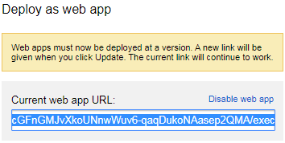

   Закройте форму (кнопка `Отмена` или крестик).
4. В **новой вкладке** перейдите по скопированной ссылке. Нажмите кнопку `REVIEW PERMISSIONS`.

   

   Выберите Google аккаунт, на котором создали копию библиотеки.

   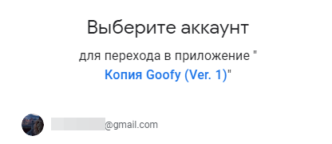

   Нажмите `Дополнительные настройки`, затем `Перейти на страницу "Копия Goofy (Ver. 1)"`

   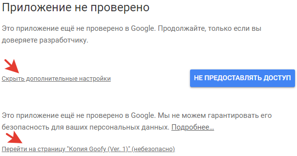

   Нажмите кнопку `Разрешить` внизу окна.

   

5. Окно закроется. Вернитесь к вкладке, в которой открывали ссылку из шага 3. Содержимое изменилось.

   Скопируйте ссылку внизу страницы. Оканчивается на `usercallback`.

   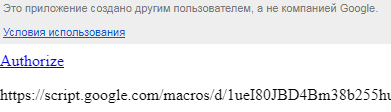

6. Перейдите в [Spotify Dashboard](https://developer.spotify.com/dashboard/). 
   
   Нажмите `Log in` и авторизируйтесь в Spotify.

   Примите условия использования.

   

7. Нажмите кнопку `Create an app`
  
   Введите произвольное имя и описание. Поставьте галочки. Нажмите кнопку `Create`.

   

8. Нажмите кнопку `EDIT SETTINGS`

   Вставьте в поле `Redirect URIs` ссылку из шага 5. Нажмите кнопку `ADD`. Затем внизу кнопку `Save`.

   

9. Скопируйте `Client ID` и `Client Secret` в библиотеку.

   Сохраните изменение `Файл` - `Сохранить` или `Ctrl + S`

   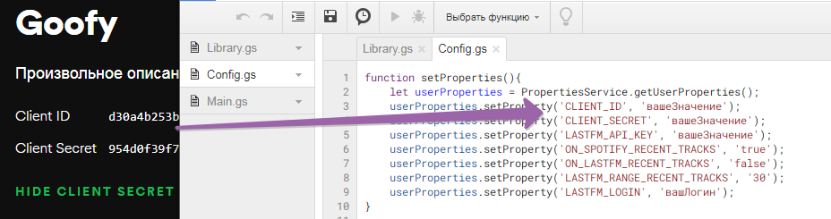

10. Запустить в редакторе выполнение функции `setProperties`.

   

11. Перейдите на вкладку из шага 5 и обновите эту страницу (`F5`).

    Нажмите кнопку `Authorize`.

    

    Разрешите доступ к аккаунту Spotify.

    

    Должны появиться слова о успешном выполнении.

    Установка и настройка завершены.

## Настройка модуля Lastfm

Если не используется, выполнять не нужно.

1. Создать точку входа [здесь](https://www.last.fm/api/account/create). Заполнить название и описание произвольно. Остальное пропустить, оставить пустым.
2. Полученный `API key` присвоить параметру `LASTFM_API_KEY`. 
3. Запустить в редакторе выполнение функции `setProperties`.


[Вернуться к оглавлению](#оглавление)

## Обновить библиотеку

1. Замените все содержимое файла `library.gs` на новое (Ctrl + A, Ctrl + V), которое берется [здесь](https://github.com/Chimildic/Goofy/blob/main/library.gs) или [здесь](https://script.google.com/d/1DnC4H7yjqPV2unMZ_nmB-1bDSJT9wQUJ7Wq-ijF4Nc7Fl3qnbT0FkPSr/edit?usp=sharing) (Ctrl + A, Ctrl + C)
2. Сохраните файл: `Файл` - `Сохранить` или Ctrl + S

[Вернуться к оглавлению](#оглавление)

# Первый плейлист

## Основные страницы
- [Мои проекты](https://script.google.com/home/my) - чтобы открыть редактор кода.
- [Мои выполнения](https://script.google.com/home/executions) - чтобы смотреть результаты выполнения кода.
- [Мои триггеры](https://script.google.com/home/triggers) - перечень установленных триггеров.

## Открыть редактор кода
1. Перейдите в [мои проекты](https://script.google.com/home/my)
2. Выберите проект `Копия Goofy (Ver. 1)` (вы могли изменить название)
3. Справа нажмите кнопку `Открыть проект` или в списке проектов на значок карандаша.
4. Перейдите в файл `main`. Сейчас он пуст.

   Большая стрелка слева сверху вернет обратно в список проектов.

   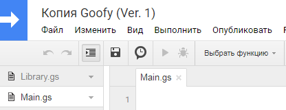

## Запуск

Откройте файл `main` в [редакторе кода](#открыть-редактор-кода) и вставьте в него следующий код функции `createHelloPlaylist`:
```
function createHelloPlaylist() {
    // Получить все любимые треки
    let tracks = Source.getSavedTracks();

    // Выбрать 5 случайных любимых треков
    Selector.keepRandom(tracks, 5);

    // Создать плейлист с этими 5 треками
    Playlist.saveWithReplace({
        name: 'Hello, playlist!',
        tracks: tracks,
    });
}
```
Сохраните файл `Ctrl + S` или в меню `Файл` - `Сохранить`.

Нажмите `Изменить` - `Триггеры текущего проекта`


Справа внизу кнопка `Добавление триггера`

- Выберите функцию `createHelloPlaylist`
- Триггер по времени
- По минутам
- Раз в минуту
- Сохраните


Зайдите в Spotify. Через минуту появится плейлист с названием `Hello, playlist!` и каждую следующую минут его содержание будет обновляться 5 случайными любимыми треками.

После проверки этого, перейдите в [список триггеров](https://script.google.com/home/triggers). Вы увидите два триггера: для функции `createHelloPlaylist`, созданный вручную ранее и для функции `updateRecentTracks`, созданный автоматически. Подробнее о нем читать в [истории прослушиваний](#история-прослушиваний).

Удалите триггер для функции `createHelloPlaylist`: справа три точки, удалить триггер. В этом же меню можно открыть список выполнений *конкретного* триггера.

Перейдите в раздел [мои выполнения](https://script.google.com/home/executions). Вы увидите общий список завершенных или выполняемых операций, их времени работы, статуса завершения, логов.

## Отладка

Для запуска функции без создания триггера, в редакторе кода выберите функцию и нажмите запуск

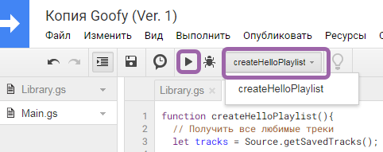

Перейдите в [мои выполнения](https://script.google.com/home/executions). Дождитесь статуса успешного завершения или сбоя. Результат появляется с некоторой задержкой относительно фактического завершения. Возможно потребуется обновить страницу, чтобы увидить статус.

Для вывода сообщений в результат выполнения используйте функцию `console.log`
```
let tracks = Source.getSavedTracks();
console.log('Количество любимых треков', tracks.length);
```
> Не передавайте в `console.log` просто `tracks`. Получится большая неинформативная стена текста.

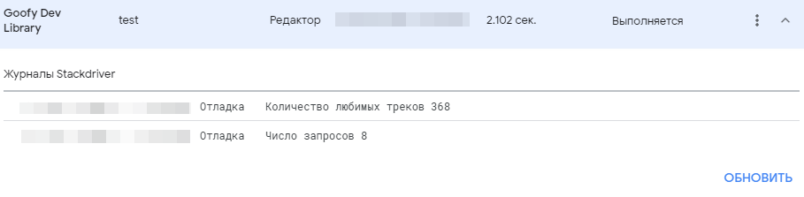

Можно вывести названия всех треков
```
let tracks = Source.getSavedTracks();
tracks.forEach(track => console.log(track.name));
```


Чтобы узнать сколько запросов потребовалось на выполнение, добавьте в конец функции следующую строку. Подробнее о запросах в [описании ограничений](#ограничения).
```
console.log('Число запросов', Request.getCountRequest());
```

[Вернуться к оглавлению](#оглавление)

## Экспресс-курс

-  `Функция`
   ```
   function myName(){
        // Тело функции
   }
   ```

   - Ключевое слово `function` обязательно. 
   - Дальше произвольное имя, здесь это `myName`.
   - Круглые скобки `()` для перечисления аргументов (входные данные). Здесь нет аргументов.
   - Фигурные скобки `{}` определяют границу функции.
   - Символы `//` для написания комментария. 

- `Переменная`
    ```
    let tracks = 5;
    tracks = 10;
    ```

    - Ключевое слово `let` обязательно при первом объявлении переменной.
    - Дальше произвольное имя. Здесь это `tracks`.
    - `= 5` присвоение переменной `tracks` значения `5`. Присвоение справа налево.
    - Точка с запятой `;` в данном языке необязательна. Но желательно для избежания сложных ошибок.
    - На второй строке присвоение 10. Значение 5 теряется.

-   Использование `функции` и `переменной`
    ```
    myName(tracks);
    ```

    - Вызов функции `myName` и передача переменной `tracks`.

[Вернуться к оглавлению](#оглавление)

</br>

# Шаблоны

Глава предлагает ряд готовых функций. Можно модифицировать предлагаемые источники, фильтры и прочие составляющие по своему усмотрению. Для этого ознакомьтесь со [справочником](#справочник).

## Установка шаблона

- Прочитайте описание шаблона и комментарии в коде
- Скопируйте функцию в конец файла `main` или в новый файл (меню `Файл` - `Создать` - `Скрипт`)
- Если требуется, замените `вашеId` на соответствующие значения и модифицируйте шаблон в соответствии с комменатриями или личными предпочтениями
- Выполните [отладку](#отладка)
- Задайте триггер, пример в [первом плейлисте](#первый-плейлист)

## Список шаблонов
- [Незнакомый сет](#незнакомый-сет)
- [Отслеживание обновлений](#отслеживание-обновлений)
- [Любимо и забыто](#любимо-и-забыто)
- [Новинки редакций](#новинки-редакций)
- [Радар жанра](#радар-жанра)
- [Копилка](#копилка)
- [Односторонняя синхронизация](#односторонняя-синхронизация)


[Вернуться к оглавлению](#оглавление)

</br>

## Незнакомый сет

|||
|-|-|
| `Рекомендация`| Ежедневный триггер, до 60 треков, история 1 тысячи прослушанных треков |
| `Источник` | Плейлисты: Радар новинок, Открытия недели и Микс дня 1-6
| `Фильтр` | Удаляются любимые треки, недавняя история прослушиваний, дубликаты треков и исполнителей. Остаются только оригинальные версии треков без кириллицы. Блокировка ряда жанров, менять по вкусу. |

</br>

```
function templateUnknownSet() {
    let banTracks = [];
    let savedTracks = Source.getSavedTracks();
    let recentTracks = Source.getRecentTracks(1000);
    Combiner.push(banTracks, savedTracks, recentTracks);

    let onlyForYouTracks = Source.getTracks([
        { name: 'Микс дня 1', id: 'вашеId' },
        { name: 'Микс дня 2', id: 'вашеId' },
        { name: 'Микс дня 3', id: 'вашеId' },
        { name: 'Микс дня 4', id: 'вашеId' },
        { name: 'Микс дня 5', id: 'вашеId' },
        { name: 'Микс дня 6', id: 'вашеId' },
        { name: 'Радар новинок', id: 'вашеId' },
        { name: 'Открытия недели', id: 'вашеId' },
    ]);
    
    Filter.dedupTracks(onlyForYouTracks);
    Filter.dedupArtists(onlyForYouTracks);
    Filter.removeTracks(onlyForYouTracks, banTracks);
    Filter.matchOriginalOnly(onlyForYouTracks);
    Filter.matchExceptRu(onlyForYouTracks);

    // Раскомментируйте, если есть плейлист с исполнителями, которых нужно блокировать
    // let banArtists = Source.getPlaylistTracks('Название', 'вашеId');
    // Filter.removeArtists(onlyForYouTracks, banArtists);
    
    Filter.rangeTracks(onlyForYouTracks, {
        artist: {
            ban_genres: ['rap', 'r&b', 'metal', 'anime', 'soul', 'blues', 'punk'],
        },
    });

    Selector.keepRandom(onlyForYouTracks, 60);
    
    Playlist.saveWithReplace({
        // id: 'вашеId', // после первого создания плейлиста
        name: 'Незнакомый сет',
        tracks: onlyForYouTracks,
        description: Playlist.getDescription(onlyForYouTracks),
        randomCover: 'update',
    });
}
```

[Вернуться к списку шаблонов](#список-шаблонов)

</br>

## Отслеживание обновлений

|||
|-|-|
| `Рекомендация`| Изменить период для [rangeDateRel](#filterrangedatereltracks-sincedays-beforedays) |
| `Источник` | Отслеживаемые плейлисты. Можно включить свои, подробнее в [getFollowedTracks](#sourcegetfollowedtrackstype-userid)
| `Фильтр` | За последние три дня исключая сегодня |

</br>

```
function templateFollowedTracks(){
    let followedTracks = Source.getFollowedTracks();
    Filter.rangeDateRel(followedTracks, 3, 1);

    // Добавить Order и Selector для ограничения количества

    Playlist.saveWithReplace({
        name: 'Отслеживание обновлений',
        tracks: followedTracks,
        description: Playlist.getDescription(followedTracks),
        randomCover: 'update',
    });
}
```

[Вернуться к списку шаблонов](#список-шаблонов)

</br>

## Любимо и забыто

|||
|-|-|
| `Рекомендация`| Еженедельный триггер, до 20 треков, история 2.5 тысяч прослушанных треков |
| `Источник` | Любимые треки
| `Фильтр` | Добавлено более 30 дней назад и непрослушивается более 125 часов (2.5 тысячи истории * 3 минуты) |

</br>

> Наиболее актуально после набора большой [истории прослушиваний](#история-прослушиваний)

```
function templateSavedAndForgot(){
    let recentTracks = Source.getRecentTracks(2500);
    let savedTracks = Source.getSavedTracks(); 
    Filter.removeTracks(savedTracks, recentTracks);
    
    let startDate = new Date('2006-01-01');
    let endDate = Filter.getDateRel(30, 'endDay');
    Filter.rangeDateAbs(savedTracks, startDate, endDate);
    
    Selector.keepRandom(savedTracks, 20);    
    Order.sort(savedTracks, 'meta.added_at', 'asc');
    Playlist.saveWithReplace({
        // id: 'вашеId', // после первого создания плейлиста
        name: 'Любимо и забыто',
        tracks: savedTracks,
        description: Playlist.getDescription(savedTracks),
        randomCover: 'update',
    });
}
```

[Вернуться к списку шаблонов](#список-шаблонов)

</br>

## Новинки редакций

|||
|-|-|
| `Рекомендация`| Еженедельный триггер, до 60 треков, история 1 тысячи прослушанных треков |
| `Источник` | Плейлисты с новинками от редакций Spotify, MTV, Topsify и других
| `Фильтр` | За неделю исключая сегодня. Удаляется недавняя история прослушиваний, дубликаты треков. Без кириллицы и миксов. Блокировка ряда жанров, менять по вкусу. С установкой минимального порога популярности. |

</br>

```
function templateNewRelease(){
    let recentTracks = Source.getRecentTracks(1000);
    let newReleaseTracks = Source.getTracks([
        // Популярные редакции
        { name: 'All New Indie', id: '37i9dQZF1DXdbXrPNafg9d' },
        { name: 'New music friday', id: '37i9dQZF1DX4JAvHpjipBk' },
        { name: 'NMEs Best New Tracks', id: '4NzWle6sDBwHLQ1tuqLKhp' },
        { name: 'Best New Music by Complex', id: '5PKZSKuHP4d27SXO5fB9Wl' },
        { name: 'MTV PUSH: Radar', id: '1RpijnCwXVGB2fxMA8km5K' },
        { name: 'Pop n Fresh by Spotify', id: '37i9dQZF1DX50KNyX4Fc9O' },
        { name: 'New Music Friday UK', id: '37i9dQZF1DX4W3aJJYCDfV' },
        { name: 'New This Week by Topsify', id: '4f0IMCLd3iciiLR4V6qXcp' },
        { name: 'Pop Rising by Topsify', id: '37i9dQZF1DWUa8ZRTfalHk' },
        
        // Менее популярные редакции
        { name: 'Disco Naivete', id: '4c6G93bHqsUbwqlqRDND9k' },
        { name: 'The Line Of Best Fit', id: '5359l8Co8qztllR0Mxk4Zv' },
        { name: 'Going Solo', id: '1ozCM0k4h6vrMlAzNaJCyy' },
        { name: '[PIAS] Monday', id: '59y1SSfAYf2DE4PmHhwNh1' },
        { name: 'undercurrents', id: '37i9dQZF1DX9myttyycIxA' },
        { name: 'XL Play', id: '1IUF5q4IvkjylMhd9P0urE' },
        { name: 'HumanHuman Most Promising', id: '5VMDrQb7imexrTLjLVjbnO' },
        { name: 'ESNS Chart', id: '72qhgUjoFVONkcQcBNQYcY' },
    ]);

    Filter.dedupTracks(newReleaseTracks);
    Filter.rangeDateRel(newReleaseTracks, 7, 1);
    Filter.removeTracks(newReleaseTracks, recentTracks);  
    Filter.matchExceptMix(newReleaseTracks);
    Filter.matchExceptRu(newReleaseTracks);
    Filter.rangeTracks(newReleaseTracks, {
        meta: {
            popularity: { min: 35, max: 100 },
        },
        artist: {
            ban_genres: ['pop', 'hip hop', 'rap', 'r&b', 'blues', 'punk', 'hollywood', 'latin', 'african', 'house'],
        },
    }); 
    
    Order.sort(newReleaseTracks, 'meta.popularity', 'desc');
    Selector.keepFirst(newReleaseTracks, 60);
        
    Playlist.saveWithReplace({
        // id: 'вашеId', // после первого создания плейлиста
        name: 'Новинки редакций',
        tracks: newReleaseTracks,
        description: Playlist.getDescription(newReleaseTracks),
        randomCover: 'update',
    });
}
```

[Вернуться к списку шаблонов](#список-шаблонов)

</br>

## Радар жанра

|||
|-|-|
| `Рекомендация`| Ежедневный триггер. Но обновление плейлиста произойдет только в назначенный день. |
| `Источник` | Рекомендации по жанру и добавления в плейлисты пользователя [spotify](https://open.spotify.com/user/spotify) за неделю
| `Фильтр` | Удаляются дубликаты треков и исполнителей. Только оригинальные версии без кириллицы. |

</br>

> ❗️ Выполнение занимает около 4 минут и отправляет порядка 2 тысяч запросов. Подробнее в [ограничениях](#ограничения) и [getFollowedTracks](#sourcegetfollowedtrackstype-userid)


```
// Вспомогательная функция
function cleanTracks(tracksArray){
    Filter.dedupTracks(tracksArray);
    Filter.dedupArtists(tracksArray);
    Filter.matchOriginalOnly(tracksArray);
    Filter.matchExceptRu(tracksArray); 
    return tracksArray;
}

function templateRandarGenre(){
    // Выбор жанра в зависимости от дня недели
    // До 5 в один день из-за getRecomTracks, подробности в справочнике
    let genres;
    if (Selector.isDayOfWeekRu('понедельник')){
        genres = ['indie'];
    } else if (Selector.isDayOfWeekRu('среда')){
        genres = ['alternative'];
    } else if (Selector.isDayOfWeekRu('пятница')){
        genres = ['rock', 'post'];
    } else {
        // Если сегодня другой день недели, не выполнять 
        return;
    }
    
    let spotifyTracks = cleanTracks(Source.getFollowedTracks({
      type: 'owned',
      userId: 'spotify'
    }));
    Filter.rangeDateRel(spotifyTracks, 7, 1);
    Filter.rangeTracks(spotifyTracks, {
        artist: {
            popularity: { min: 25, max: 100},
            genres: genres,
            ban_genres: ['rap', 'r&b', 'edm', 'hip-hop', 'metal', 'anime', 
                         'soul', 'blues', 'punk', 'dance', 'latino', 'african'],
        },
    });
    
    let recomTracks = cleanTracks(Source.getRecomTracks({
        seed_genres: genres.join(','),
    }));
    
    let tracks = Combiner.mixin(spotifyTracks, recomTracks, 2, 2, true);
    Selector.keepFirst(tracks, 60);
    
    Playlist.saveWithReplace({
        name: 'Радар жанра',
        tracks: tracks,
        description: Playlist.getDescription(tracks),
        randomCover: 'update',
    });
   
    console.log('Число запросов', Request.getCountRequest());
}

```

[Вернуться к списку шаблонов](#список-шаблонов)

</br>

## Копилка

|||
|-|-|
| `Рекомендация`| Один или несколько плейлистов, которые обновляются раз в неделю |
| `Источник` | Например, плейлист `Радар новинок`
| `Фильтр` | Удаляются дубликаты треков, а также ранее прослушанное |

```
function templateCollectPlaylist(){
    let recentTracks = Source.getRecentTracks(1000);
    let newTracks = Source.getPlaylistTracks('Радар новинок', 'вашеId');

    // После первого создания плейлиста 
    // let currentTracks = Source.getPlaylistTracks('Копилка: Радар новинок', 'вашеId');
    // Combiner.push(newTracks, currentTracks);
    
    Filter.dedupTracks(newTracks);
    Filter.removeTracks(newTracks, recentTracks);
    // Если используется история прослушиваний с lastfm
    // Lastfm.removeRecentTracks(newTracks, 'ваш логин lastfm', 1000);
    
    Playlist.saveWithReplace({
      // id: 'вашеId', // После первого создания плейлиста 
      name: 'Копилка: Радар новинок',
      tracks: newTracks,
      randomCover: 'update',
    });
}
```

[Вернуться к списку шаблонов](#список-шаблонов)

</br>

## Односторонняя синхронизация

Добавлять в любимое треки, взятые с лайков Яндекс.Музыки. Сразу все может не получиться из-за квоты на время выполнения скрипта. Подробнее в [ограничениях](https://github.com/Chimildic/Goofy/blob/main/guide/README.md#ограничения). Поэтому предлагается установить триггер раз в неделю и подстроить под себя число треков для поиска. К пример, в коде это 50. Значит каждую неделю проверяются последние 50 лайков Яндекс.Музыки и если есть новые, добавляются в Spotify.
```
function templateYandexSync() {
    let yandexTracks = Yandex.getTracks('owner', '3', 50);
    let savedTracks = Source.getSavedTracks();
    Filter.removeTracks(yandexTracks, savedTracks);
    console.log('Лайков с Яндекса за неделю', yandexTracks.length);
    Library.saveFavoriteTracks(yandexTracks);
}
```

[Вернуться к списку шаблонов](#список-шаблонов)

</br>

# Справочник

Глава описывает функции библиотеки Goofy и приводит пример их использования.

- Source - источник получения треков
- RecentTracks - получение истории прослушиваний
- Combiner - объединение треков разных источников 
- Filter - отсеивание треков по разным признакам 
- Selector - отбор количества треков по позиции
- Order - сортировка треков
- Playlist - создание или обновление плейлиста
- Library - действия над любимыми треками и подписками на исполнителей
- Lastfm - модуль по работе с сервисом Last fm
- Yandex - модуль по работе с Яндекс.Музыкой
- Cache - модуль для сохранения массивов на Google Диск

[Вернуться к оглавлению](#оглавление)

## Полный список функций

- Source
  - [getTracks](#sourcegettracksplaylistarray)
  - [getTracksRandom](#sourcegettracksrandomplaylistarray-countplaylist)
  - [getPlaylistTracks](#sourcegetplaylisttracksname-id-user)
  - [getTopTracks](#sourcegettoptracksstrtoprange)
  - [getRecentTracks](#sourcegetrecenttrackslimit)
  - [getFollowedTracks](#sourcegetfollowedtracksparams)
  - [getSavedTracks](#sourcegetsavedtracks)
  - [getSavedAlbumTracks](#sourctgetsavedalbumtrackslimit)
  - [getRecomTracks](#sourcegetrecomtracksqueryobj)
  - [getTracksArtists](#sourcegettracksartistsparams)
- RecentTracks
  - [get](#recenttracksgetlimit)
  - [compress](#recenttrackscompress)
- Combiner
  - [push](#combinerpushsourcearray-additionalarray)
  - [mixin](#combinermixinxarray-yarray-xrow-yrow-tolimiton)
  - [alternate](#combineralternatebound-arrays)
- Filter
  - [removeTracks](#filterremovetrackssourcearray-removedarray)
  - [removeArtists](#filterremoveartistssourcearray-removedarray)
  - [dedupTracks](#filterdeduptrackstracks)
  - [dedupArtists](#filterdedupartiststracks)
  - [getDateRel](#filtergetdatereldays-bound)
  - [rangeDateRel](#filterrangedatereltracks-sincedays-beforedays)
  - [rangeDateAbs](#filterrangedateabstracks-startdate-enddate)
  - [rangeTracks](#filterrangetrackstracks-args)
  - [getLastOutRange](#filtergetlastoutrange)
  - [match](#filtermatchtracks-strregex-invent)
  - [matchExcept](#filtermatchExcepttracks-strregex)
  - [matchExceptRu](#filtermatchExceptrutracks)
  - [matchExceptMix](#filtermatchExceptmixtracks)
  - [matchLatinOnly](#filtermatchlatinonlytracks)
  - [matchOriginalOnly](#filtermatchoriginalonlytracks)
- Selector
  - [keepFirst](#selectorkeepfirstarray-count) и [sliceFirst](#selectorslicefirstarray-count)
  - [keepLast](#selectorkeeplastarray-count) и [sliceLast](#selectorslicelastarray-count)
  - [keepAllExceptFirst](#selectorkeepallexceptfirstarray-skipcount) и [sliceAllExceptFirst](#selectorsliceAllExceptFirstarray-skipcount)
  - [keepAllExceptLast](#selectorkeepallexceptlastarray-skipcount) и [sliceAllExceptLast](#selectorsliceAllExceptLastarray-skipcount)
  - [keepRandom](#selectorkeeprandomarray-count) и [sliceRandom](#selectorsliceRandomarray-count)
  - [keepNoLongerThan](#selectorkeepnolongerthantracks-minutes) и [sliceNoLongerThan](#selectorsliceNoLongerThantracks-minutes)
  - [sliceCopy](#selectorsliceCopyarray)
  - [isWeekend](#selectorisweekend)
  - [isDayOfWeekRu](#selectorisdayofweekrustrday)
  - [isDayOfWeek](#selectorisdayofweekstrday-locale)
- Order
  - [sort](#ordersorttracks-pathkey-direction)
  - [shuffle](#ordershufflearray)
  - [reverse](#orderreversearray)
  - [separateArtists](#orderseparateartiststracks-space-israndom)
- Playlist
  - [saveAsNew](#playlistsaveasnewdata)
  - [saveWithReplace](#playlistsavewithreplacedata)
  - [saveWithAppend](#playlistsavewithappenddata)
  - [getDescription](#playlistgetdescriptiontracks-limit)
- Library
  - [followArtists](#libraryfollowartistsartists) и [unfollowArtists](#libraryunfollowartistsartists)
  - [saveFavoriteTracks](#librarysaveFavoriteTrackstracks) и [deleteFavoriteTracks](#librarydeleteFavoriteTrackstracks)
- Lastfm
  - [getRecentTracks](#lastfmgetrecenttracksuser-limit)
  - [getLovedTracks](#lastfmgetlovedtracksuser-limit)
  - [getTopTracks](#lastfmgettoptracksparams)
  - [getMixStation](#lastfmgetmixstationuser-countrequest)
  - [getLibraryStation](#lastfmgetlibrarystationuser-countrequest)
  - [getRecomStation](#lastfmgetrecomstationuser-countrequest)
  - [getNeighboursStation](#lastfmgetneighboursstationuser-countrequest)
  - [removeRecentTracks](#lastfmremoverecenttrackssourcearray-lastfmuser-limit)
  - [removeRecentArtists](#lastfmremoverecentartistssourcearray-lastfmuser-limit)
- Yandex
  - [getTracks](#yandexgettracksowner-kinds-limit-offset)
  - [getArtists](#yandexgetartistsowner-limit-offset)
- Cache
  - [read](#cachereadfilename)
  - [write](#cachewritefilename-content)
  - [append](#cacheappendfilename-content-place-limit)
  - [copy](#cachecopyfilename)
  - [compressTracks](#cachecompresstrackstracks)

## Дополнительно

- [Параметры](#параметры)
- [Идентификатор](#идентификатор)
- [Особенности трека (features)](#особенности-трека-features)
- [Жанры для отбора рекомендаций](#жанры-для-отбора-рекомендаций)

[Вернуться к оглавлению](#оглавление)

</br>

## Параметры 

| Параметр | Тип | Описание |
|-|-|-|
| `CLIENT_ID` и `CLIENT_SECRET` | строка | Ключи для доступа к Spotify Web API. Получаются во время [первой установки](#установка-и-настройка). |
| `LASTFM_API_KEY` | строка | Ключ для работы с Lastfm API. Получается [дополнительно](#настройка-модуля-lastfm). |
| `ON_SPOTIFY_RECENT_TRACKS` | бул | При `true` отслеживание истории прослушиваний Spotify. При `false` отключается. |
| `ON_LASTFM_RECENT_TRACKS` | бул | При `true` отслеживание истории прослушиваний Lastfm. При `false` отключается. |
| `LASTFM_RANGE_RECENT_TRACKS` | число | Количество последних треков, которые просматриваются в истории Lastfm за прошедшие 15 минут. |
| `LASTFM_LOGIN` | строка | Логин пользователя Lastfm, чья история собирается. |

<br>

[Вернуться к оглавлению](#оглавление)

## Source.getTracks(playlistArray) 

Получить массив треков одного и более плейлистов.

Обязательные аргументы
- (массив) `playlistArray` - один и более плейлист. 
 
Формат одного плейлиста
- `id` - [идентификационный номер плейлиста](#плейлист).
- `userId` - [идентификационный номер пользователя](#пользователь).
- `name` - имя плейлиста.

| id | name | userId | Действие |
|:-:|:-:|:-:|:-|
| ✓ | ☓ | ☓ | Взять плейлист с указанным id |
| ☓ | ✓ | ☓ | Поиск плейлиста по имени среди ваших |
| ☓ | ✓ | ✓ | Поиск плейлиста по имени у пользователя |

</br>

> 💡 Рекомендуется всегда указывать `id` и `name`. Наиболее быстрый и удобный способ.

> ❗️ Если указано `name` без `id` и есть несколько плейлистов с таким именем, вернутся треки из первого встретившегося.
> 
>  Когда плейлист не найден, вернется пустой массив.

</br>

Пример 1 - Получить треки двух плейлистов по `id`. Значение `name` необязательно. Указывается для удобства.
```
let tracks = Source.getTracks([
  { name: 'Главные хиты', id: '37i9dQZF1DX12G1GAEuIuj' },
  { name: 'Кардио', id: '37i9dQZF1DWSJHnPb1f0X3' },
]);
```

Пример 2 - Получить треки личных плейлистов The Best и Саундреки.
```
let tracks = Source.getTracks([
  { name: 'The Best' },
  { name: 'Саундреки' },
]);
```

Пример 3 - Получить треки плейлиста с названием mint у пользователя spotify.
```
let tracks = Source.getTracks([
  { name: 'mint', userId: 'spotify' },
]);
```

[Вернуться к списку функций](#полный-список-функций)

</br>

## Source.getTracksRandom(playlistArray, countPlaylist)

Получить массив треков одного и более случайно выбранных плейлистов.

Аргументы
- (массив) `playlistArray` - один и более плейлист. Аналогично [getTracks](#sourcegettracksplaylistarray).
- (число) `countPlaylist` - количество случайно выбираемых плейлистов. По умолчанию один.

Пример 1 - Получить треки одного случайно выбранного плейлиста из трех.
```
let tracks = Source.getTracksRandom([
  { name: 'Главные хиты', id: '37i9dQZF1DX12G1GAEuIuj' },
  { name: 'Кардио', id: '37i9dQZF1DWSJHnPb1f0X3' },
  { name: 'Темная сторона', id: '37i9dQZF1DX73pG7P0YcKJ' },
]);
```

Пример 2 - Получить треки двух случайно выбранных плейлистов из трех.
```
let playlistArray = [
  { name: 'Главные хиты', id: '37i9dQZF1DX12G1GAEuIuj' },
  { name: 'Кардио', id: '37i9dQZF1DWSJHnPb1f0X3' },
  { name: 'Темная сторона', id: '37i9dQZF1DX73pG7P0YcKJ' },
];
let tracks = Source.getTracksRandom(playlistArray, 2);
```

[Вернуться к списку функций](#полный-список-функций)

</br>

## Source.getPlaylistTracks(name, id, user)

Получить массив треков одного плейлиста. Аналогично [getTracks](#sourcegettracksplaylistarray) с одним плейлистом.

Пример 1 - Получить треки одного плейлиста
```
let tracks = Source.getPlaylistTracks('Заблокированный треки', 'abcdef');
```

[Вернуться к списку функций](#полный-список-функций)

</br>

## Source.getTopTracks(strTopRange)

Получить массив личного топа треков за выбранный период. До 90 треков.

Аргументы
- (строка) `strTopRange` - период. По умолчанию `medium`.

|strTopRange|Период|
|-|-|
| short | Примерно последний месяц |
| medium | Примерно последние 6 месяцев |
| long | За несколько лет |

</br>

> ❗️ Такие треки не содержат информации о дате добавления. При использовании [rangeDateRel](#filterrangedatereltracks-sincedays-beforedays) или [rangeDateAbs](#filterrangedateabstracks-startdate-enddate) им присваивается дата 01.01.2000

Пример 1 - Получить топ за последний месяц.
```
let tracks = Source.getTopTracks('short');
```

Пример 2 - Получить топ за несколько лет.
```
let tracks = Source.getTopTracks('long');
```

[Вернуться к списку функций](#полный-список-функций)

</br>

## Source.getRecentTracks(limit)

Получить массив треков с недавней историей прослушиваний. Сортировка треков от свежих прослушиваний к старым. Подробности работы [здесь](https://github.com/Chimildic/Goofy/blob/main/guide/README.md#история-прослушиваний).

Аргументы
- (число) `limit` - предельное количество треков. По умолчанию 200. Максимум 20 тысяч.

Пример 1 - Получить последние 200 прослушанных треков.
```
let tracks = Source.getRecentTracks();
```

Пример 2 - Получить последнюю тысячу прослушанных треков.
```
let tracks = Source.getRecentTracks(1000);
```

[Вернуться к списку функций](#полный-список-функций)

</br>

## Source.getFollowedTracks(params)

Получить массив треков отслеживаемых плейлистов и/или личных плейлистов указанного пользователя.

Аргументы
- (объект) `params` - аргументы отбора плейлистов

Полный объект `params`
```
{
    type: 'followed',
    userId: 'abc',
    limit: 2,
    exclude: [
        { name: 'playlist 1', id: 'abc1' },
        { id: 'abc2' }, // playlist 2
    ],
}
```

Описание аргументов
- (строка) `type` - тип выбираемых плейлистов. По умолчанию `followed`.
- (строка) `userId` - [идентификатор пользователя](#идентификатор). Если не указан, устанавливается `userId` авторизированного пользователя, то есть ваш.
- (число) `limit` - если используется, плейлисты выбираются случайным образом.
- (массив) `exclude` - перечень плейлистов, которые нужно исключить. Значимо только `id`. Значение `name` необязательно, нужно лишь для понимания какой это плейлист. Можно обойтись комментарием.

|type|Выбор|
|-|-|
| owned | Только личные плейлисты |
| followed | Только отслеживаемые плейлисты |
| all | Все плейлисты |

</br>

Пример 1 - Получить треки только из моих отслеживаемых плейлистов.
```
// Все значения по умолчанию, аргументы не указываются
let tracks = Source.getFollowedTracks();

// Тоже самое с явным указанием типа плейлистов
let tracks = Source.getFollowedTracks({
    type: 'followed',
});
```

Пример 2 - Получить треки только двух случайно выбранных личных плейлистов пользователя `example`, исключая несколько плейлистов по их id. 
```
let tracks = Source.getFollowedTracks({
    type: 'owned',
    userId: 'example',
    limit: 2, 
    exclude: [
        { id: 'abc1' }, // playlist 1
        { id: 'abc2' }, // playlist 2
    ],
});
```

> ❗️ Следует избегать пользователей со слишком большим количеством плейлистов. Например, `glennpmcdonald` почти с 5 тысячами плейлистов. Ограничение связано с квотой на выполнение в Apps Script. За отведенное время неудастся получить такой объем треков. Подробнее в [описании ограничений](#ограничения).

[Вернуться к списку функций](#полный-список-функций)

</br>


## Source.getSavedTracks()

Получить массив со всеми любимыми треками.

Аргументов нет.

Пример 1 - Получить массив любимых треков.
```
let tracks = Source.getSavedTracks();
```

[Вернуться к списку функций](#полный-список-функций)

</br>

## Sourct.getSavedAlbumTracks(limit)

Получить массив треков всех сохраненных альбомов. Можно выбрать несколько случайных.

Аргументы:
- (число) `limit` - если используется, альбомы выбираются случайно.

Пример 1 - Получить треки трех случайных альбомов
```
let tracks = Source.getSavedAlbumTracks(3);
```

Пример 2 - Получить треки из всех сохраненных альбомов
```
let tracks = Source.getSavedAlbumTracks();
```

[Вернуться к списку функций](#полный-список-функций)

</br>

## Source.getRecomTracks(queryObj)

Получить массив рекомендованных треков по заданным параметрам. До 100 треков.

Обязательные аргументы
- (объект) `queryObj` - параметры для отбора рекомендаций.

Допустимые параметры
- limit - количество треков. Максимум 100.
- seed_* - до **5 значений** в любых комбинациях:
  - seed_artists - [идентификаторы исполнителей](#идентификатор), разделенных запятой.
  - seed_tracks - [идентификаторы треков](#идентификатор), разделенных запятой.
  - seed_genres - жанры, разделенные запятой. Допустимые значения смотреть [здесь](#жанры-для-отбора-рекомендаций).
- max_* - предельное значение одной из [особенностей (features) трека](#особенности-трека-features).
- min_* - минимальное значение одной из [особенностей (features) трека](#особенности-трека-features).
- target_* - целевое значение одной из [особенностей (features) трека](#особенности-трека-features). Выбираются наиболее близкие по значению.

Пример объекта с параметрами
```
let queryObj = {
      seed_artists: '',
      seed_genres: '',
      seed_tracks: '',
      max_*: 0,
      min_*: 0,
      target_*: 0,
};
```

Пример 1 - Получить рекомендации по жанру инди и альтернативы с позитивным настроением:
```
let tracks = Source.getRecomTracks({
      seed_genres: 'indie,alternative',
      min_valence: 0.65,
});
```

Пример 2 - Получить рекомендации в жанре рок и электроники на основе 3 случайных любимых исполнителей (до 5 значений).
```
let savedTracks = Source.getSavedTracks();
Selector.keepRandom(savedTracks, 3);

let artistIds = savedTracks.map(track => track.artists[0].id);

let tracks = Source.getRecomTracks({
      seed_artists: artistIds.join(','),
      seed_genres: 'rock,electronic'
});
```

[Вернуться к списку функций](#полный-список-функций)

</br>

## Source.getTracksArtists(params)

Возвращает массив треков исполнителей согласно заданным `params`

> ❗️ В выборку попадает множество альбомов. Особенно при большом количетсве отслеживаемых исполнителей (100+). Для сокращения времени выполнения используйте фильтры для исполнителя и альбома. Можно указать случайный выбор N-количества.

Обязательный аргумент
- (объект) `params` - перечень критериев отбора исполнителей и их треков

| Ключ | Тип | Описание |
|-|-|-|
| followed_include | бул | При `true` включает отслеживаемых исполнителей. При `false` исполнители берутся только из `include` |
| include | массив | Выборка исполнителей по `id` для получения альбомов. Ключ `name` для удобства и необязателен.  |
| exclude | массив | Выборка исполнителей по `id` для исключения исполнителей из выборки. Использовать в комбинации с `followed_include` |
| popularity | объект | Диапазон популярности исполнителя |
| followers | объект | Диапазон количества фолловеров исполнителя |
| genres | массив | Перечень жанров. Если хотя бы один есть, исполнитель проходит фильтр.  |
| ban_genres | массив | Перечень жанров для бана. Если хотя бы один есть, исполнитель удаляется из выборки. |
| groups | строка | Тип альбома. Допустимо: `album`, `single`, `appears_on`, `compilation` |
| release_date | объект | Дата выхода альбома. Относительный период при `sinceDays` и `beforeDays`. Абсолютный период при `startDate` и `endDate` |
| _limit | число | Если указано, выбирается случайное количество указанных элементов (artist, album, track) |

Пример объекта `params` со всеми ключами
```
{
    artist: {
        followed_include: true,
        popularity: { min: 0, max: 100 },
        followers: { min: 0, max: 100000 },
        artist_limit: 10,
        genres: ['indie'],
        ban_genres: ['rap', 'pop'],
        include: [
            { id: '', name: '' }, 
            { id: '', name: '' },
        ],
        exclude:  [
            { id: '', name: '' }, 
            { id: '', name: '' },
        ],
    },
    album: {
        groups: 'album,single',
        release_date: { sinceDays: 6, beforeDays: 0 },
        // release_date: { startDate: new Date('2020.12.01'), endDate: new Date('2020.12.08') },
        album_limit: 10,
        track_limit: 1,
    }
}
```

Пример 1 - Получить треки из синглов отслеживаемых исполнителей, вышедших за последнюю неделю включая сегодня. Исключить несколько исполнителей.
```
let tracks = Source.getTracksArtists({
    artist: {
        followed_include: true,
        exclude:  [
            { id: 'abc1', name: '' }, 
            { id: 'abc2', name: '' },
        ],
    },
    album: {
        groups: 'single',
        release_date: { sinceDays: 7, beforeDays: 0 },
    },
});
```

Пример 2 - Получить треки из альбомов и синглов за неделю десяти отслеживаемых исполнителей, выбранных случайным образом. Исполнители с не более чем 10 тысячами подписчиков. Только один трек из альбома.
```
let tracks = Source.getTracksArtists({
    artist: {
        followed_include: true,
        artist_limit: 10,
        followers: { min: 0, max: 10000 },
    },
    album: {
        groups: 'album,single',
        track_limit: 1,
        release_date: { sinceDays: 7, beforeDays: 0 },
    },
});
```

Пример 3 - Получить треки из альбомов и синглов указанных исполнителей
```
let tracks = Source.getTracksArtists({
    artist: {
        followed_include: false,
        include:  [
            { id: 'abc1', name: '' }, 
            { id: 'abc2', name: '' },
        ],
    },
    album: {
        groups: 'album,single',
    },
});
```

[Вернуться к списку функций](#полный-список-функций)

</br>

## RecentTracks.get(limit)

Возвращает массив истории прослушиваний в зависимости от [параметров](#параметры). Все варианты отсортированы от свежих к старым прослушиваниям. Можно использовать [rangeDateRel](#filterrangedatereltracks-sincedays-beforedays).

Необязательный аргумент
- (число) `limit` - ограничить количество возвращаемых треков. 

| Включенный параметр | Возвращаемый массив |
|-|-|
| `ON_SPOTIFY_RECENT_TRACKS` | История прослушиваний только Spotify |
| `ON_LASTFM_RECENT_TRACKS` | История прослушиваний только Lastfm.   |
| `ON_SPOTIFY_RECENT_TRACKS` и `ON_LASTFM_RECENT_TRACKS` | Объединение обоих источников с удалением дубликатов треков. |

</br>

## RecentTracks.compress()

Сжимает треки в существующих накопительных файлах истории прослушиваний в зависимости от [параметров](#параметры). Предварительно создает копию файла.

Входных аргументов нет.

> Используется для совместимости с прошлыми версиями библиотеки. Достаточно одного выполнения, чтобы сжать файлы истории прослушиваний. Новые треки историии сжимаются автоматически.

[Вернуться к списку функций](#полный-список-функций)

</br>

## Combiner.push(sourceArray, ...additionalArray)

Добавить в конец первого массива все элементы второго массива и так далее.

Обязательные аргументы
- (массив) `sourceArray` - первый массив, к которому добавляются элементы остальных.
- (перечень массивов) `...additionalArray` - перечень остальных массивов.

Пример 1 - Добавить элементы второго массива в конец первого массива.
```
let firstArray = Source.getTracks(playlistArray); // допустим, 20 треков
let secondeArray = Source.getSavedTracks(); // допустим, 40 треков
Combiner.push(firstArray, secondeArray);
// теперь в firstArray 60 треков
```

Пример 2 - Добавить к первому массиву элементы двух других.
```
let firstArray = Source.getTracks(playlistArray); // допустим, 25 треков
let secondeArray = Source.getSavedTracks(); // допустим, 100 треков
let thirdArray = Source.getRecentTracks(); // допустим, 20 треков
Combiner.push(firstArray, secondeArray, thirdArray);
// теперь в firstArray 145 треков
```

[Вернуться к списку функций](#полный-список-функций)

</br>

## Combiner.mixin(xArray, yArray, xRow, yRow, toLimitOn)

Возвращает новый массив, в котором чередуются элементы двух массивов в заданной пропорции.

Обязательные аргументы
- (массив) `xArray` - первый массив источник.
- (массив) `yArray` - второй массив источник.
- (число) `xRow` - количество подряд идущих элементов первого массива.
- (число) `yRow`- количество подряд идущих элементов второго массива.
- (булево) `toLimitOn` - элементы чередуются до тех пор, пока пропорцию можно сохранить. Если `true` лишние элементы не включаются в результат. Если `false` добавляются в конец результата.

Пример 1 - Чередовать элементы в пропорции 1 к 1. Сохранить все элементы.
```
let firstArray = [1, 3, 5];
let secondArray = [2, 4, 6, 8, 10];
let resultArray = Combiner.mixin(firstArray, secondArray, 1, 1, false);
// результат: 1, 2, 3, 4, 5, 6, 8, 10
```

Пример 2 - Чередовать элементы в пропорции 2 к 1. Удалить лишние элементы.
```
let firstArray = [10, 20, 30, 40];
let secondArray = [22, 44, 55];
let resultArray = Combiner.mixin(firstArray, secondArray, 2, 1, true);
// результат: 10, 20, 22, 30, 40, 44
// не включено: 55
```

Пример 3 - Чередовать треки плейлистов-источников и любимые треки в пропорции 5 к 1. Удалить лишние.
```
let tracks = Source.getTracks(playlistArray);
let savedTracks = Source.getSavedTracks();
let resultArray = Combiner.mixin(tracks, savedTracks, 5, 1, true);
```

[Вернуться к списку функций](#полный-список-функций)

</br>

## Combiner.alternate(bound, ...arrays)

Возвращает новый массив, в котором чередуются элементы массивов источников.

Обязательные аргументы
- (строка) bound - допустимое значение `max` или `min`.
  - Если элементы в одном из массивов закончились, добавляет оставшиеся элементы другого массива в конец (`max`). При нескольких оставшихся массивах, продолжает чередовать их элементы.
  - Если хотя бы в одном массиве закончились элементы, немедленно возвращает результат (`min`). Оставшиеся элементы отбрасываются.
- (перечень массивов) `...arrays` - перечень массивов, чьи элементы необходимо чередовать.

Пример 1 - Чередовать элементы трех массивов.
```
let firstArray = [1, 3, 5];
let secondeArray = [2, 4, 6, 8, 10];
let thirdArray = [100, 200, 300];
let resultArray = Combiner.alternate('max', firstArray, secondeArray, thirdArray);
// результат 1, 2, 100, 3, 4, 200, 5, 6, 300, 8, 10
```

Пример 2 - Чередовать топ прослушиваний за месяц и любимые треки.
```
let topTracks = Source.getTopTracks('short'); // допустим, 50 треков
let savedTracks = Source.getSavedTracks(20); //допустим, 20 треков
let resultArray = Combiner.alternate('min', topTracks, savedTracks);
// результат содержит 40 треков
```

[Вернуться к списку функций](#полный-список-функций)

</br>

## Filter.removeTracks(sourceArray, removedArray) 

Удаляет из `sourceArray` треки, которые есть в `removedArray`. Совпадение определяется по `id` трека или по названию трека вместе с исполнителем.

Обязательные аргументы
- (массив) `sourceArray` - массив треков, в котором нужно удалить треки.
- (массив) `removedArray` - массив треков, которые требуется удалить.

Пример 1 - Получить треки плейлистов и исключить любимые треки.
```
let sourceArray = Source.getTracks(playlistArray);
let removedArray = Source.getSavedTracks();
Filter.removeTracks(sourceArray, removedArray);
```

[Вернуться к списку функций](#полный-список-функций)

</br>

## Filter.removeArtists(sourceArray, removedArray)

Удаляет из `sourceArray` треки исполнителей, которые есть в `removedArray`. Совпадение определяется по `id` основого исполнителя трека.

Обязательные аргументы
- (массив) `sourceArray` - массив треков, в котором нужно удалить треки.
- (массив) `removedArray` - массив треков, которые требуется удалить. Выбирается не трек, а исполнитель.

Пример 1 - Получить треки плейлистов и исключить исполнителей любимых треков.
```
let sourceArray = Source.getTracks(playlistArray);
let removedArray = Source.getSavedTracks();
Filter.removeArtists(sourceArray, removedArray);
```

[Вернуться к списку функций](#полный-список-функций)

</br>

## Filter.dedupTracks(tracks)

Удаляет дубликаты треков по `id` и `name`.

Обязательные аргументы
- (массив) `tracks` - массив треков, в котором требуется удалить дубликаты.

Пример 1 - Удалить дубликаты.
```
let tracks = Source.getTracks(playlistArray);
Filter.dedupTracks(tracks);
```

[Вернуться к списку функций](#полный-список-функций)

</br>

## Filter.dedupArtists(tracks)

Удаляет дубликаты основных исполнителей по `id`. То есть если у трека несколько исполнителей, выбирается первый в списке. Обычно он главный. В результате, массив содержит по одному треку каждого исполнителя.

Обязательные аргументы
- (массив) `tracks` - массив треков, в котором требуется удалить дубликаты основных исполнителей.

Пример 1 - Удалить дубликаты основных исполнителей.
```
let tracks = Source.getTracks(playlistArray);
Filter.dedupArtists(tracks);
```

[Вернуться к списку функций](#полный-список-функций)

</br>

## Filter.getDateRel(days, bound)

Возвращает дату со смещением в днях относительно сегодня.

Аргументы
- (число) `days` - количество дней для смещения.
- (строка) `bound` - обнуление часов. При `startDay` 00:00, при `endDay` 23:59. Если не указать, время согласно моменту обращения.

Пример в шаблоне [любимо и забыто](#любимо-и-забыто).

[Вернуться к списку функций](#полный-список-функций)

</br>

## Filter.rangeDateRel(tracks, sinceDays, beforeDays)

Оставить только треки, добавленные за указанный период относительно сегодня.

> ❗️ Если трек не содержит даты добавления или прослушивания, устанавливается дата 01.01.2000. Такое возможно если трек добавлен очень давно, источником является [getTopTracks](#sourcegettoptracksstrtoprange) или это плейлисты "Мой микс дня #N". Для перечисленного Spotify не имеет или не дает дату.

Аргументы
- (массив) `tracks` - массив треков.
- (число) `sinceDays` - стартовая граница. По умолчанию сегодня 00:00.
- (число) `beforeDays` - предельная граница. По умолчанию сегодня 23:59.

Ниже пример для `sinceDays` = 7 и `beforeDays` = 2. То есть получить треки, добавленные в плейлист с 3 сентября 00:00 по 8 сентрября 23:59 относительно сегодня, 10 сентября. 


Пример 1 - Треки, добавленные за последние 5 дней и сегодня.
```
let tracks = Source.getTracks(playlistArray);
Filter.rangeDateRel(tracks, 5);
// аналогично Filter.rangeDateRel(tracks, 5, 0);
```

Пример 2 - Треки за последние 7 дней исключая сегодня.
```
let tracks = Source.getTracks(playlistArray);
Filter.rangeDateRel(tracks, 7, 1);
```

Пример 3 - Треки за один день, который был 14 дней назад.
```
let tracks = Source.getTracks(playlistArray);
Filter.rangeDateRel(tracks, 14, 14);
```

Пример 4 - Треки только за сегодня.
```
let tracks = Source.getTracks(playlistArray);
Filter.rangeDateRel(tracks);
// аналогично Filter.rangeDateRel(tracks, 0, 0);
```

[Вернуться к списку функций](#полный-список-функций)

</br>

## Filter.rangeDateAbs(tracks, startDate, endDate)

Оставить только треки, добавленные за указанный абсолютный период. Для периода относительно сегодня, использовать [rangeDateRel](#filterrangedatereltracks-sincedays-beforedays).

> ❗️ Предупреждение описано в [rangeDateRel](#filterrangedatereltracks-sincedays-beforedays).

Обязательные аргументы
- (массив) `tracks` - массив треков.
- (дата) `startDate` - стартовая граница.
- (дата) `endDate` - предельная граница.

Формат даты `YYYY-MM-DDTHH:mm:ss.sss` где
- `YYYY-MM-DD` - год, месяц, день
- `T` - разделитель для указания времени. Указать, если добавляется время.
- `HH:mm:ss.sss` - часы, минуты, секунды, миллисекунды

Пример 1 - Треки, добавленные между 1 и 3 сентября.
```
let tracks = Source.getTracks(playlistArray);
let startDate = new Date('2020-09-01');
let endDate = new Date('2020-09-03');
Filter.rangeDateAbs(tracks, startDate, endDate);
```

Пример 2 - Треки, добавленные с 1 августа 15:00 по 20 августа 10:00.
```
let tracks = Source.getTracks(playlistArray);
let startDate = new Date('2020-08-01T15:00');
let endDate = new Date('2020-08-20T10:00');
Filter.rangeDateAbs(tracks, startDate, endDate);
```

Пример 3 - Треки, добавленные с 1 сентября по текущую дату и время.
```
let tracks = Source.getTracks(playlistArray);
let startDate = new Date('2020-09-01');
let endDate = new Date();
Filter.rangeDateAbs(tracks, startDate, endDate);
```

[Вернуться к списку функций](#полный-список-функций)

</br>

## Filter.rangeTracks(tracks, args)

Оставляет только треки, кототорые удовлетворяют условиям `args`. Треки непрошедшие проверку удаляются из оригинального массива `tracks`. 

Обязательные аргументы
- (массив) `tracks` - проверяемые треки. 
- (объект) `args` - условия проверки на принадлежность диапазону `min` - `max` (границы включительно), равенству или присутствию жанра.

Категории проверки параметров
- `meta` - трек
- `features` - особенности трека
- `artist` - основной исполнитель трека
- `album` - альбом трека

> ❗️ Функция запрашивает дополнительные данные для `features`, `artist`, `album`. Чтобы сократить число запросов, используйте ее после максимального сокращения массива треков другими способами (например, [rangeDateRel](rangeDateRel), [match](#filtermatchtracks-strregex-invent) и другие). Полученные данные кэшируются для **текущего** выполнения. Повторный вызон функции или сортировка [sort](#ordersorttracks-pathkey-direction) с теми же категориями не отправляют новых запросов.

Ниже пример объекта `args` со всеми допустимыми условиями проверки. Описание параметров читать [здесь](#описание-параметров-объектов).
```
let args = {
    meta: {
        popularity: { min: 0, max: 100 },
        duration_ms: { min: 0, max: 10000 },
        explicit: false,
    },
    artist: {
        popularity: { min: 0, max: 100 },
        followers: { min: 0, max: 100000 },
        genres: ['indie'],
        ban_genres: ['rap', 'pop'],
    },
    features: {
        acousticness: { min: 0.0, max: 1.0 },
        danceability: { min: 0.0, max: 1.0 },
        energy: { min: 0.0, max: 1.0 },
        instrumentalness: { min: 0.0, max: 1.0 },
        liveness: { min: 0.0, max: 1.0 },
        loudness: { min: -60, max: 0 },
        speechiness: { min: 0.0, max: 1.0 },
        valence: { min: 0.0, max: 1.0 },
        tempo: { min: 30, max: 210 },
        key: 0,
        mode: 0,
        time_signature: 1,

        // дублирует args.meta.duration_ms, достаточно одного (выбор зависит от категории)
        duration_ms: { min: 0, max: 10000 },
    },
    // Не рекомендуется использовать
    // album: {
    //     popularity: { min: 30, max: 70 },
    //     genres: [], // Тесты показывают, что у альбомов список жанров всегда пуст
    //     release_date: { sinceDays: 6, beforeDays: 0 },
    //     или release_date: { startDate: new Date('2020.12.01'), endDate: new Date('2020.12.08') },
    // },
};
```

Пример 1 - Исключить треки жанра рэп.
```
let tracks = Source.getTracks(playlistArray);
Filter.rangeTracks(tracks, {
    artist: {
      ban_genres: ['rap'],
    }
});
```

Пример 2 - Оставить только треки в жанре инди и альтернативы.
```
let tracks = Source.getTracks(playlistArray);
Filter.rangeTracks(tracks, {
    artist: {
        genres: ['indie', 'alternative'],
    },
});
```

Пример 3 - Оставить только малопопулярные треки от малоизвестных исполнителей.
```
let tracks = Source.getTracks(playlistArray);
Filter.rangeTracks(tracks, {
    meta: {
      popularity: { min: 0, max: 49 },
    },
    artist: {
      followers: { min: 0, max: 9999 },
    },
});
```

[Вернуться к списку функций](#полный-список-функций)

</br>

## Filter.getLastOutRange()

Получить новый массив с треками, которые не прошли последнюю проверку функции [rangeTracks](#filterrangetrackstracks-args).

Нет аргументов.

Пример 1 - Получить треки непрошедшие проверку.
```
let tracks = Source.getTracks(playlistArray);
Filter.rangeTracks(tracks, args);
let outRangeTracks = Filter.getLastOutRange();
```

## Filter.match(tracks, strRegex, invent)

Оставляет только треки, которые удовлетворяют условию `strRegex` по названию трека и альбома.

Аргументы
- (массив) `tracks` - массив треков.
- (строка) `strRegex` - строка регулярного выражения.
- (булево) `invent` - если `true` инверсия результата. По умолчанию `false`. 

Пример 1 - Удалить треки, содержащие в своем названии слова `cover` или `live`.
```
let tracks = Source.getTracks(playlistArray);
Filter.match(tracks, 'cover|live', true);
```

[Вернуться к списку функций](#полный-список-функций)

</br>

## Filter.matchExcept(tracks, strRegex)
Оставляет только треки, которые **не** удовлетворяют условию `strRegex` по названию трека и альбома.

Аналогично [match](#filtermatchtracks-strregex-invent) с аргументом `invent = true`

</br>

## Filter.matchExceptMix(tracks)
Удаляет треки, содержащие `mix` и `club`.

Аналогично [matchExcept](#filtermatchExcepttracks-strregex) с аргументом `strRegex = 'mix|club'`

</br>

## Filter.matchExceptRu(tracks)
Удаляет треки, содержащие кириллицу.

Аналогично [matchExcept](#filtermatchExcepttracks-strregex) с аргументом `strRegex = '^[а-яА-Я0-9]+'`

</br>

## Filter.matchLatinOnly(tracks)
Оставляет треки, которые содержат названия только на латинице. То есть удаляет иероглифы, кириллицу и прочее. 

Аналогично [match](#filtermatchtracks-strregex-invent) с аргументом `strRegex = '^[a-zA-Z0-9]+'`

</br>

## Filter.matchOriginalOnly(tracks)
Удаляет неоригинальные версии треков.

Аналогично [matchExcept](#filtermatchExcepttracks-strregex) с аргументом `strRegex = 'mix|club|radio|piano|acoustic|edit|live|version|cover'`

[Вернуться к списку функций](#полный-список-функций)

</br>

## Selector.sliceFirst(array, count)

Возвращает новый массив, состоящий из первых `count` элементов массива `array`.

> Разница функций `keep*` и `slice*`:
> 
> - `keep*` изменяет содержимое оригинального массива, 
> - `slice*` возвращает новый массив, не изменяя оригинала.

Обязательные аргументы
- (массив) `array` - массив, из которого берутся элементы.
- (число) `count` - количество элементов.

Пример 1 - Получить первые 100 треков.
```
let tracks = Source.getTracks(playlistArray);
tracks = Selector.sliceFirst(tracks, 100);
```

[Вернуться к списку функций](#полный-список-функций)

</br>

## Selector.keepFirst(array, count)

Оставляет только первые `count` элементов массива `array`.

Обязательные аргументы
- (массив) `array` - массив, у которого изменяются элементы.
- (число) `count` - количество элементов.

Пример 1 - Оставить первые 100 треков.
```
let tracks = Source.getTracks(playlistArray);
Selector.keepFirst(tracks, 100);
```

[Вернуться к списку функций](#полный-список-функций)

</br>

## Selector.sliceLast(array, count)

Возвращает новый массив, состоящий из последних `count` элементов массива `array`.

Обязательные аргументы
- (массив) `array` - массив, из которого берутся элементы.
- (число) `count` - количество элементов.

Пример 1 - Получить последние 100 треков.
```
let tracks = Source.getTracks(playlistArray);
tracks = Selector.sliceLast(tracks, 100);
```

[Вернуться к списку функций](#полный-список-функций)

</br>

## Selector.keepLast(array, count)

Оставляет только последние `count` элементы массива `array`.

Обязательные аргументы
- (массив) `array` - массив, у которого изменяются элементы.
- (число) `count` - количество элементов.

Пример 1 - Оставить последние 100 треков.
```
let tracks = Source.getTracks(playlistArray);
Selector.keepLast(tracks, 100);
```

[Вернуться к списку функций](#полный-список-функций)

</br>

## Selector.sliceAllExceptFirst(array, skipCount)

Возвращает новый массив, состоящий из всех элементов массива `array` кроме `skipCount` первых.

Обязательные аргументы
- (массив) `array` - массив, из которого берутся элементы.
- (число) `skipCount` - количество пропускаемых элементов.

Пример 1 - Получить все треки кроме первых 10.
```
let tracks = Source.getTracks(playlistArray);
tracks = Selector.sliceAllExceptFirst(tracks, 10);
```

[Вернуться к списку функций](#полный-список-функций)

</br>

## Selector.keepAllExceptFirst(array, skipCount)

Оставляет все элементы массива `array` кроме `skipCount` первых.

Обязательные аргументы
- (массив) `array` - массив, у которого изменяются элементы.
- (число) `skipCount` - количество пропускаемых элементов.

Пример 1 - Оставить все треки кроме первых 10.
```
let tracks = Source.getTracks(playlistArray);
Selector.keepAllExceptFirst(tracks, 10);
```

[Вернуться к списку функций](#полный-список-функций)

</br>

## Selector.sliceAllExceptLast(array, skipCount)

Возвращает новый массив, состоящий из всех элементов массива `array` кроме `skipCount` последних.

Обязательные аргументы
- (массив) `array` - массив, из которого берутся элементы.
- (число) `skipCount` - количество пропускаемых элементов.

Пример 1 - Получить все треки кроме последних 10.
```
let tracks = Source.getTracks(playlistArray);
tracks = Selector.sliceAllExceptLast(tracks, 10);
```

[Вернуться к списку функций](#полный-список-функций)

</br>

## Selector.keepAllExceptLast(array, skipCount)

Оставляет все элементы массива `array` кроме `skipCount` последних.

Обязательные аргументы
- (массив) `array` - массив, у которого изменяются элементы.
- (число) `skipCount` - количество пропускаемых элементов.

Пример 1 - Оставить все треки кроме последних 10.
```
let tracks = Source.getTracks(playlistArray);
Selector.keepAllExceptLast(tracks, 10);
```

[Вернуться к списку функций](#полный-список-функций)

</br>

## Selector.sliceRandom(array, count)

Возвращает новый массив, состоящий из случайно отобранных элементов исходного массива.

Обязательные аргументы
- (массив) `array` - массив, из которого берутся элементы.
- (число) `count` - количество случайно выбираемых элементов.

Пример 1 - Получить 20 случайных треков.
```
let tracks = Source.getTracks(playlistArray);
tracks = Selector.sliceRandom(tracks, 20);
```

[Вернуться к списку функций](#полный-список-функций)

</br>

## Selector.keepRandom(array, count)

Оставить `count` случайно выбранных элементов массива `array`.

Обязательные аргументы
- (массив) `array` - массив, у которого изменяются элементы.
- (число) `count` - количество случайно выбираемых элементов.

Пример 1 - Оставить 20 случайных треков.
```
let tracks = Source.getTracks(playlistArray);
Selector.keepRandom(tracks, 20);
```

[Вернуться к списку функций](#полный-список-функций)

</br>

## Selector.sliceNoLongerThan(tracks, minutes)

Возвращает новый массив треков с общей длительностью не более, чем `minutes` минут.

Обязательные аргументы
- (массив) `tracks` - исходный массив треков.
- (число) `minutes` - количество минут.

Пример 1 - Получить треки с общей продолжительностью не более, чем 60 минут.
```
let tracks = Source.getTracks(playlistArray);
tracks = Selector.sliceNoLongerThan(tracks, 60);
```

[Вернуться к списку функций](#полный-список-функций)

</br>

## Selector.keepNoLongerThan(tracks, minutes)

Оставить треки, чья общая продолжительность не превышает `minutes` минут.

Обязательные аргументы
- (массив) `tracks` - массив треков, у которого изменяются элементы.
- (число) `minutes` - количество минут.

Пример 1 - Оставить треки с общей продолжительностью не более, чем 60 минут.
```
let tracks = Source.getTracks(playlistArray);
Selector.keepNoLongerThan(tracks, 60);
```

[Вернуться к списку функций](#полный-список-функций)

</br>

## Selector.sliceCopy(array)

Возвращает новый массив, который является копией исходного массива.

Обязательные аргументы
- (массив) `array` - исходный массив, копию которого нужно создать.

Пример 1 - Создать копию массива.
```
let tracks = Source.getTracks(playlistArray);
let tracksCopy = Selector.sliceCopy(tracks);
```

[Вернуться к списку функций](#полный-список-функций)

</br>

## Selector.isWeekend()

Возвращает булево значение: `true` если сегодня суббота или пятница и `false` если нет.

Аргументов нет.

Пример использования
```
if (Selector.isWeekend()){
    // сегодня выходной
} else {
   // будни
}
```

[Вернуться к списку функций](#полный-список-функций)

</br>

## Selector.isDayOfWeekRu(strDay)

Возвращает булево значение: `true` если сегодня день недели `strDay` и `false` если нет. Значение дня недели кириллицей.

Обязательные аргументы
- (строка) `strDay` - день недели. Допустимые значения: `понедельник`, `вторник`, `среда`, `четверг`, `пятница`, `суббота`, `воскресенье`.

Пример использования
```
if (Selector.isDayOfWeekRu('понедельник')){
    // сегодня понедельник
} else if (Selector.isDayOfWeekRu('среда')) {
    // сегодня среда
} else {
    // другой день недели
}
```

[Вернуться к списку функций](#полный-список-функций)

</br>

## Selector.isDayOfWeek(strDay, locale)

Возвращает булево значение: `true` если сегодня день недели `strDay` и `false` если нет.

Аргументы
- (строка) `strDay` - день недели.
- (строка) `locale` - локаль дня недели. По умолчанию `en-US`, для которой допустимы значения: `sunday`, `monday`, `tuesday`, `wednesday`, `thursday`, `friday`, `saturday`.

Пример использования
```
if (Selector.isDayOfWeek('friday')){
    // сегодня пятница
} else {
    // другой день недели
}
```

[Вернуться к списку функций](#полный-список-функций)

</br>

## Order.sort(tracks, pathKey, direction)

Сортирует оригинальный массив по заданному ключу.

> ❗️ Функция делает дополнительные запросы. Чтобы сократить число запросов, используйте ее после максимального сокращения массива треков другими спрособами. Подробнее в [rangeTracks](#filterrangetrackstracks-args).

Аргументы
- (массив) `tracks` - массив треков, который нужно отсортировать.
- (строка) `pathKey` - ключ сортировки.
- (строка) `direction` - направление сортировки: `asc` по возрастанию, `desc` по убыванию. По умолчанию `asc`.

Допустимые ключи в формате `категория.ключ`. Описание ключей [здесь](#описание-параметров-объектов).

| Категория | Ключ |
|-|-|
| meta | name, popularity, duration_ms, explicit, added_at, played_at |
| features | acousticness, danceability, energy, instrumentalness, liveness, loudness, speechiness, valence, tempo, key, mode, time_signature, duration_ms |
| artist | popularity, followers, name |
| album | Не рекомендуется использовать. popularity, name |

</br>

Пример 1 - Сортировка по убывающей популярности исполнителей
```
Order.sort(tracks, 'artist.popularity', 'desc');
```

Пример 2 - Сортировка по возростающей энергичности
```
Order.sort(tracks, 'features.energy', 'asc');
```

[Вернуться к списку функций](#полный-список-функций)

</br>

## Order.shuffle(array)

Перемешивает элементы массива случайным образом.

Обязательные аргументы
- (массив) `array` - массив, чьи элементы необходимо перемешать.

Пример 1 - Случайное перемешивание
```
let array = [1, 2, 3, 4, 5, 6];

Order.shuffle(array);
// результат 3, 5, 4, 6, 2, 1

Order.shuffle(array);
// результат 6, 1, 2, 3, 5, 4

Order.shuffle(array);
// результат 6, 5, 2, 3, 1, 4
```

Пример 2 - Перемешать треки
```
let tracks = Source.getTracks(playlistArray);
Order.shuffle(tracks);
```

[Вернуться к списку функций](#полный-список-функций)

</br>

## Order.reverse(array)

Обратная сортировка. Первый элемент станет последним и наоборот.

Обязательные аргументы
- (массив) `array` - массив, чьи элементы необходимо отсортировать в обратном направлении.

Пример 1 - Обратная сортировка
```
let array = [1, 2, 3, 4, 5, 6];

Order.reverse(array);
// результат 6, 5, 4, 3, 2, 1

Order.reverse(array);
// результат 1, 2, 3, 4, 5, 6
```

Пример 2 - Обратная сортировка треков плейлиста
```
let tracks = Source.getTracks(playlistArray);
Order.reverse(tracks);
```

[Вернуться к списку функций](#полный-список-функций)

</br>

## Order.separateArtists(tracks, space, isRandom)

Сортировка, при которой соблюдается минимальный отступ между одним и тем же исполнителем. Треки, которые неудалось разместить будут исключены.

Обязательные аргументы
- (массив) `tracks` - массив треков, который нужно отсортировать.
- (число) `space` - значение минимального отступа.
- (булево) `isRandom` - влияет на сортировку. Если `true` выполяется случайная сортировка оригинального массива, что повлияет на порядок при разделении исполнителей. Если `false` без случайной сортировки. Тогда результат при одинаковых входных треках будет тоже одинаковыми. По умолчанию `false`.

Пример 1 - Условный пример разделения
```
let array = ['cat', 'cat', 'dog', 'lion']
Order.separateArtists(array, 1, false);
// результат cat, dog, cat, lion

array = ['cat', 'cat', 'dog', 'lion']
Order.separateArtists(array, 1, false);
// повторный вызов, результат тот же: cat, dog, cat, lion

array = ['cat', 'cat', 'dog', 'lion']
Order.separateArtists(array, 1, true);
// повторный вызов и случайная сортировка: cat, lion, dog, cat
```

Пример 2 - Разделить одного и того же исполнителя минимум двумя другими.
```
let tracks = Source.getTracks(playlistArray);
Order.separateArtists(tracks, 2);
```

[Вернуться к списку функций](#полный-список-функций)

</br>

## Playlist.saveAsNew(data)

Создает плейлист. Каждый раз новый.

Обязательные аргументы
- (объект) `data` - данные для создания плейлиста.

Формат данных для создания плейлиста
- (строка) `name` - название плейлиста, обязательно.
- (массив) `tracks` - массив треков, обязательно.
- (строка) `description` - описание плейлиста. До 300 символов.
- (булево) `public` - если `false` плейлист будет приватным. По умолчанию `true`.
- (строка) `randomCover` - добавить случайную обложку при значении `once`. Без использования, стандартная мозайка от Spotify.

Пример 1 - Создать публичный плейлист с любимыми треками без описания со случайной обложкой
```
let tracks = Source.getSavedTracks();
Playlist.saveAsNew({
  name: 'Копия любимых треков',
  tracks: tracks,
  randomCover: 'once',
});
```

Пример 2 - Создать приватный плейлист с недавней историей прослушиваний и описанием без обложки.
```
let tracks = Source.getRecentTracks(200);
Playlist.saveAsNew({
  name: 'История прослушиваний',
  description: '200 недавно прослушанных треков'
  public: false,
  tracks: tracks,
});
```

[Вернуться к списку функций](#полный-список-функций)

</br>

## Playlist.saveWithReplace(data)

Заменяет треки плейлиста. Обновляет остальные данные (название, описание). Если плейлиста еще нет, создает новый.

Обязательные аргументы
- (объект) `data` - данные о плейлисте.

Формат данных о плейлисте
- (строка) `id` - [идентификационный номер плейлиста](#идентификатор).
- (строка) `name` - название плейлиста, обязательно.
- (массив) `tracks` - массив треков, обязательно.
- (строка) `description` - описание плейлиста. До 300 символов.
- (булево) `public` - если `false` плейлист будет приватным. По умолчанию `true`.
- (строка) `randomCover` - если `once` добавит случайную обложку. При `update` каждый раз обновляет обложку. Без использования, стандартная мозайка от Spotify.

> 💡 Рекомендуется всегда указывать `id`. Если `id` не указано, поиск по названию. Если такого плейлиста нет, создается новый.

Пример 1 - Обновить содержимое плейлиста и обложку
```
let tracks = Source.getTracks(playlistArray);
Playlist.saveWithReplace({
    id: 'fewf4t34tfwf4',
    name: 'Микс дня',
    description: 'Описание плейлиста',
    tracks: tracks,
    randomCover: 'update',
});
```

Пример 2 - Обновить содержимое плейлиста из примера 1. Поиск по названию.
```
let tracks = Source.getRecentTracks();
Playlist.saveWithReplace({
    name: 'Микс дня',
    description: 'Новое описание плейлиста',
    tracks: tracks,
    randomCover: 'update',
});
```

[Вернуться к списку функций](#полный-список-функций)

</br>

## Playlist.saveWithAppend(data)

Добавляет треки к уже имеющимся в плейлисте. Обновляет остальные данные (название, описание). Если плейлиста еще нет, создает новый.

Обязательные аргументы
- (объект) `data` - данные о плейлисте. Формат данных о плейлисте согласно описанию [saveWithReplace](#playlistsavewithreplacedata).

Дополнительно к формату о плейлисте
- (булево) `toEnd` - если `true`, добавляет треки в конец списка. Если `false`, в начало. По умолчанию `false`.

Пример 1 - Добавить треки в начало плейлиста.
```
let tracks = Source.getTracks(playlistArray);
Playlist.saveWithAppend({
    id: 'fewf4t34tfwf4',
    name: 'Микс дня',
    tracks: tracks
});
```

Пример 2 - Добавить треки в конец плейлиста, обновить название и описание.
```
let tracks = Source.getTracks(playlistArray);
Playlist.saveWithAppend({
    id: 'fewf4t34tfwf4',
    name: 'Новое название',
    description: 'Новое описание',
    tracks: tracks,
    toEnd: true,
});
```

> ❗️ Если обновить название плейлиста без указания `id` будет создан новый плейлист. Потому что поиск не найден плейлист с новым названием.

[Вернуться к списку функций](#полный-список-функций)

</br>

## Playlist.getDescription(tracks, limit)

Возвращает строку вида: `Исполнитель 1, Исполнитель 2... и не только`.

Аргументы
- (массив) `tracks` - треки, из которых случайно выбираются исполнители.
- (число) `limit` - количество случайно выбираемых исполнителей. По умолчанию 5.

Пример 1 - Создать плейлист с описанием
```
let tracks = Source.getTracks(playlistArray);
Playlist.saveWithReplace({
    id: 'abcd',
    name: 'Большой микс дня',
    tracks: tracks,
    description: Playlist.getDescription(tracks),
});
```

[Вернуться к списку функций](#полный-список-функций)

</br>

## Library.followArtists(artists)

Подписаться на исполнителей

Обязательные аргументы
- (массив) `artists` - перечень исполнителей. Значимо только `id`.

Пример в [Yandex.getArtists](https://github.com/Chimildic/Goofy/blob/main/guide/README.md#yandexgetartistsowner-limit-offset)

## Library.unfollowArtists(artists)

Отписаться от исполнителей

Обязательные аргументы
- (массив) `artists` - перечень исполнителей. Значимо только `id`.

Пример аналогичен [Yandex.getArtists](https://github.com/Chimildic/Goofy/blob/main/guide/README.md#yandexgetartistsowner-limit-offset). Только использовать `unfollowArtists`.

[Вернуться к списку функций](#полный-список-функций)

</br>

## Library.saveFavoriteTracks(tracks)

Добавить треки в любимые (поставить лайк)

Обязательные аргументы
- (массив) `tracks` - перечень треков. Значимо только `id`.

Пример 1 - Добавить последние 50 лайков из Яндекс в Spotify
```
let yandexTracks = Yandex.getTracks('owner', '3', 50);
let savedTracks = Source.getSavedTracks();
Filter.removeTracks(yandexTracks, savedTracks);
Library.saveFavoriteTracks(yandexTracks);
```

## Library.deleteFavoriteTracks(tracks)

Удалить треки из любимых (снять лайки)

Обязательные аргументы
- (массив) `tracks` - перечень треков. Значимо только `id`.

Пример 1 - Очистить все лайки Spotify
```
let savedTracks = Source.getSavedTracks();
Library.deleteFavoriteTracks(savedTracks);
```

[Вернуться к списку функций](#полный-список-функций)

</br>

## Lastfm.getRecentTracks(user, limit)

Возвращает массив недавно прослушанных треков пользователя `user`, ограниченного количеством `limit`. 

> ❗️ Источником треков является lastfm. Эквивалент трека находится поиском Spotify по наилучшему совпадению. Если совпадения нет, трек игнорируется. 
> 
> Один трек lastfm равен одному запросу поиска. Будьте внимательны с [ограничениями](#ограничения) по количеству запросов в день и времени выполнения.

Обязательные аргументы
- (строка) `user` - логин пользователя Last.fm, чью историю прослушиваний нужно искать.
- (число) `limit` - предельное количество треков.

Пример 1 - Получить 200 недавно прослушанных треков
```
let tracks = Lastfm.getRecentTracks('login', 200);
```

[Вернуться к списку функций](#полный-список-функций)

</br>

## Lastfm.getLovedTracks(user, limit)

Возвращает массив любимых треков пользователя `user`, ограниченного количеством `limit`. Внимание на предупреждение из [getRecentTracks](#lastfmgetrecenttracksuser-limit).

Обязательные аргументы
- (строка) `user` - логин пользователя Last.fm, чьи любимые треки нужно искать.
- (число) `limit` - предельное количество треков.

Пример 1 - Получить 200 любимых треков
```
let tracks = Lastfm.getLovedTracks('login', 200);
```

[Вернуться к списку функций](#полный-список-функций)

</br>

## Lastfm.getTopTracks(params)

Возвращает массив с топом треков по заданному периоду. Внимание на предупреждение из [getRecentTracks](#lastfmgetrecenttracksuser-limit).

Обязательные аргументы
- (объект) `params` - параментры для выбора топа треков.

Допустимые значения `params`
```
{
  user: 'login', // логин пользователя last.fm
  period: 'overall', // период, допустимо: overall | 7day | 1month | 3month | 6month | 12month
  limit: 50 // предельное количество треков
}
```

Пример 1 - Получить топ-40 за полгода
```
let tracks = Lastfm.getTopTracks({
  user: 'ваш логин',
  period: '6month',
  limit: 40
});
```

[Вернуться к списку функций](#полный-список-функций)

</br>

## Lastfm.getMixStation(user, countRequest)

Возвращает массив треков из радио last fm `Микс`. Содержит ранее заскробленные треки и рекомендации last fm. Внимание на предупреждение из [getRecentTracks](#lastfmgetrecenttracksuser-limit).

Обязательные аргументы
- (строка) `user` - логин пользователя, чье радио является источником.
- (число) `countRequest` - количество запросов к last fm. Один запрос дает примерно от 20 до 30 треков.

Пример использования
```
let tracks = Lastfm.getMixStation('login', 2);
```

[Вернуться к списку функций](#полный-список-функций)

</br>

## Lastfm.getLibraryStation(user, countRequest)

Возвращает массив треков из радио last fm `Библиотека`. Содержит только заскробленные ранее треки. Внимание на предупреждение из [getRecentTracks](#lastfmgetrecenttracksuser-limit).

Обязательные аргументы
- (строка) `user` - логин пользователя, чье радио является источником.
- (число) `countRequest` - количество запросов к last fm. Один запрос дает примерно от 20 до 30 треков.

Пример использования
```
let tracks = Lastfm.getLibraryStation('login', 2);
```

[Вернуться к списку функций](#полный-список-функций)

</br>

## Lastfm.getRecomStation(user, countRequest)

Возвращает массив треков из радио last fm `Рекомендации`. Содержит только рекомендации last fm. Внимание на предупреждение из [getRecentTracks](#lastfmgetrecenttracksuser-limit).

Обязательные аргументы
- (строка) `user` - логин пользователя, чье радио является источником.
- (число) `countRequest` - количество запросов к last fm. Один запрос дает примерно от 20 до 30 треков.

Пример использования
```
let tracks = Lastfm.getRecomStation('login', 2);
```

[Вернуться к списку функций](#полный-список-функций)

</br>

## Lastfm.getNeighboursStation(user, countRequest)

Возвращает массив треков из радио last fm `Соседи`. Содержит треки, которые слушают пользователи last fm со схожими вам музыкальными вкусами. Внимание на предупреждение из [getRecentTracks](#lastfmgetrecenttracksuser-limit).

Обязательные аргументы
- (строка) `user` - логин пользователя, чье радио является источником.
- (число) `countRequest` - количество запросов к last fm. Один запрос дает примерно от 20 до 30 треков.

Пример использования
```
let tracks = Lastfm.getNeighboursStation('login', 2);
```

[Вернуться к списку функций](#полный-список-функций)

</br>

## Lastfm.removeRecentTracks(sourceArray, lastfmUser, limit)

Удаляет из массива треков `sourceArray` историю недавно прослушанных `limit` треков пользователя `lastfmUser`. Совпадение определяется по названию трека и исполнителя. Требуется [дополнительная настройка](#настройка-модуля-lastfm).

Обязательные аргументы
- (массив) `sourceArray` - массив треков, в котором нужно удалить треки.
- (строка) `lastfmUser` - логин пользователя Last.fm, чью историю прослушиваний нужно исключить.
- (число) `limit` - предельное количество треков истории прослушиваний. По умолчанию 600.

Пример 1 - Создать плейлист с любимыми треками, которые не были прослушаны за последние 5 тысяч скроблов Last.fm пользователя `login`
```
let savedTracks = Source.getSavedTracks();
Lastfm.removeRecentTracks(savedTracks, 'login', 5000)
Playlist.saveAsNew({
  name: 'Давно не слушал',
  tracks: savedTracks,
});
```

[Вернуться к списку функций](#полный-список-функций)

</br>

## Lastfm.removeRecentArtists(sourceArray, lastfmUser, limit)
Удаляет из массива треков `sourceArray` историю недавно прослушанных `limit` треков пользователя `lastfmUser`. Совпадение определяется только по имени исполнителя. Требуется [дополнительная настройка](#настройка-модуля-lastfm).

Обязательные аргументы
- (массив) `sourceArray` - массив треков, в котором нужно удалить треки.
- (строка) `lastfmUser` - логин пользователя Last.fm, чью историю прослушиваний нужно исключить.
- (число) `limit` - предельное количество треков истории прослушиваний. По умолчанию 600.

Пример как у [removeRecentTracks](#lastfmremoverecenttrackssourcearray-lastfmuser-limit)

[Вернуться к списку функций](#полный-список-функций)

</br>

## Yandex.getTracks(owner, kinds, limit, offset)

Возвращает массив треков плейлиста Яндекс.Музыки. Поиск аналога в базе Spotify по имени исполнителя и названию трека. Внимание на [ограничения](#ограничения). Один трек = один запрос поиска. Указанный пользователь должен иметь публично доступную библиотеку. Настройка находится [здесь](https://music.yandex.ru/settings/other). Кроме того, сам плейлист должен быть публичным (у них есть локальная приватность).

> ❗️ Поиск осуществляется по наилучшему первому совпадению. Поэтому могут появляться "артефакты". Например, треки, которые являются полными синонимами или попытка найти трек, которого нет в базе.

Обязательные аргументы
- (строка) `owner` - логин пользователя Яндекс.Музыки
- (строка) `kinds` - номер плейлиста
- (число) `limit` - количество выбираемых треков. Если не указано, все.
- (число) `offset` - смещение от первого трека. Например, `limit` = 50 и `offset` = 50 вернут треки от 50-го до 100-го.

Аргументы берутся из ссылки на плейлист. Например, для ссылки `https://music.yandex.ru/users/yamusic-daily/playlists/46484894`: логин это `yamusic-daily`, номер это `46484894`.

Пример 1 - Создать Плейлист дня из треков Яндекс.Музыки
```
 Playlist.saveWithReplace({
     // id: 'ваше id', // после первого создания
     name: 'Плейлист дня',
     tracks: Yandex.getTracks('yamusic-daily', 'ваше id плейлиста дня'),
     randomCover: 'update',
 });
```

[Вернуться к списку функций](#полный-список-функций)

</br>

## Yandex.getArtists(owner, limit, offset)

Возвращает массив исполнителей из подписок Яндекс.Музыки указанного пользователя. Поиск аналога в базе Spotify по имени исполнителя. Внимание на [ограничения](#ограничения). Один исполнитель = один запрос поиска. Указанный пользователь должен иметь публично доступную библиотеку. Настройка находится [здесь](https://music.yandex.ru/settings/other).

> ❗️ Поиск осуществляется по наилучшему первому совпадению. Поэтому могут появляться "артефакты". Например, вместо исполнителя [Shura](https://open.spotify.com/artist/1qpR5mURxk3d8f6mww6uKT) найдется [Шура](https://open.spotify.com/artist/03JHGoUoM1LQmuXqknBi5P).

Обязательные аргументы
- (строка) `owner` - логин пользователя Яндекс.Музыки
- (число) `limit` - количество выбираемых исполнителей. Если не указано, все.
- (число) `offset` - смещение от первого исполнителя. Например, `limit` = 50 и `offset` = 50 вернут исполнителей от 50-го до 100-го.

Пример 1 - Подписаться на 50 последних исполнителей с Яндекса в Spotify. Можно запускать через триггер. Таким образом получить одностороннюю синхронизацию.
```
let artists = Yandex.getArtists('owner', 50);
Library.followArtists(artists);
```

[Вернуться к списку функций](#полный-список-функций)

</br>

## Cache.read(filename)

Возвращает массив из файла. 

Обязательный аргумент
- (строка) `filename` - имя файла

Пример 1 - Добавить треки из файла в плейлист
```
let tracks = Cache.read('file.json');
Playlist.saveAsNew({
    name: 'Треки из файла',
    tracks: tracks,
});
```

[Вернуться к списку функций](#полный-список-функций)

</br>

## Cache.write(filename, content)

Записывает данные в файл. Если файла не существует, создает его. Если файл есть, перезаписывает содержимое.

Обязательные аргументы
- (строка) `filename` - имя файла
- (массив) `content` - массив данных для записи

Пример 1 - Записать любимые треки в файл
```
let tracks = Sourct.getSavedTracks();
Cache.write('liked.json', tracks);
```

[Вернуться к списку функций](#полный-список-функций)

</br>

## Cache.append(filename, content, place, limit)

Записывает данные в файл, добавляя новые данные. Если файла не существует, создает его. 

Аргументы
- (строка) `filename` - имя файла
- (массив) `content` - массив данных для добавления
- (строка) `place` - место присоединения. При `begin` в начало файла. При `end` в конец файла. По умолчанию `end`.
- (число) `limit` - ограничить число элементов массива **после** присоединения новых данных. По умолчанию, выбор **первых** 100 тысяч (sliceFirst). Для постоянного обновления потребуется `place` равный 'begin'.

Пример 1 - Добавить новые треки в начало файла. Ограничить массив 5 тысячами треков.
```
let tracks = Source.getPlaylistTracks('playlist name', 'id');
Cache.append('myfile.json', tracks, 'begin', 5000);
```

Пример 2 - Добавить треки в конец файла. Лимит 100 тысяч. Значения по умолчанию.
```
let tracks = Source.getPlaylistTracks('playlist name', 'id');
Cache.append('myfile.json', tracks);
```

[Вернуться к списку функций](#полный-список-функций)

</br>

## Cache.copy(filename)

Создает копию файла. Возвращает имя созданной копии.

Обязательный аргумент
- (строка) `filename` - имя файла

Пример 1 - Создать копию файла и получить его данные
```
let filename = 'myfile.json';
filename = Cache.copy(filename);
let tracks = Cache.read(filename);
```

[Вернуться к списку функций](#полный-список-функций)

</br>

## Cache.compressTracks(tracks)

Удаляет излишние данные о треках. Позволяет существенно сократить объем файла.

Обязательные аргументы
- (массив) `tracks` - массив треков

Пример 1 - Сжать треки и сохранить в файл
```
let tracks = Source.getPlaylistTracks('playlist name', 'id');
Cache.compressTracks(tracks);
Cache.write('myfile.json', tracks);
```

[Вернуться к списку функций](#полный-список-функций)

</br>

## Идентификатор

Таблицы ниже показывают как получить идентификатор из ссылки или URI.

### Плейлист

| id или playlistId | URI | Ссылка |
|-|-|-|
| 5ErHcGR1VdYQmsrd6vVeSV | spotify:playlist:**5ErHcGR1VdYQmsrd6vVeSV** | [open.spotify.com/playlist/**5ErHcGR1VdYQmsrd6vVeSV**](open.spotify.com/playlist/5ErHcGR1VdYQmsrd6vVeSV) |
| 4vTwFTW4DytSY1N62itnwz | spotify:playlist:**4vTwFTW4DytSY1N62itnwz** | [open.spotify.com/playlist/**4vTwFTW4DytSY1N62itnwz**](open.spotify.com/playlist/4vTwFTW4DytSY1N62itnwz) |

</br>

### Пользователь

Для старых аккаунтов равен логину. Для новых аккаунтов последовательность букв и цифр.

| userId | URI | Ссылка |
|-|-|-|
| glennpmcdonald | spotify:user:**glennpmcdonald** | [open.spotify.com/user/**glennpmcdonald**](open.spotify.com/user/glennpmcdonald) |
| ldxdnznzgvvftcpw09kwqm151 | spotify:user:**ldxdnznzgvvftcpw09kwqm151** | [open.spotify.com/user/**ldxdnznzgvvftcpw09kwqm151**](open.spotify.com/user/ldxdnznzgvvftcpw09kwqm151) |

</br>

[Вернуться к списку функций](#полный-список-функций)

## Описание параметров объектов

Таблица описывает основные ключи объектов Spotify в вольном переводе. Оригинал можно прочитать [здесь](https://developer.spotify.com/documentation/web-api/reference/tracks/get-audio-features/).

| Ключ | Диапазон | Описание |
|-|-|-|
| `popularity` | 0 - 100 |Популярность трека, исполнителя или альбома. Более популярны те, что ближе к 100.</br> <ul><li>Трек. Рассчитывается исходя из общего числа прослушиваний и насколько они недавны. Трек с большим количеством недавних прослушиваний будет более популярным, чем трекс с большим количество старых прослушиваний. Значение может иметь лаг в несколько дней, то есть не обновляется в реальном времени.</li> <li>Исполнитель и альбом. Рассчитывается исходя из популярности треков.</li></ul> 
| `duration_ms` | 0 - 0+ | Продолжительность трека в миллесекундах ([калькулятор](https://www.google.ru/search?ie=UTF-8&q=%D0%BC%D0%B8%D0%BD%D1%83%D1%82%D1%8B%20%D0%B2%20%D0%BC%D0%B8%D0%BB%D0%BB%D0%B8%D1%81%D0%B5%D0%BA%D1%83%D0%BD%D0%B4%D1%8B%20%D0%BA%D0%B0%D0%BB%D1%8C%D0%BA%D1%83%D0%BB%D1%8F%D1%82%D0%BE%D1%80)). Полезно для удаления треков с маленькой продолжительностью путем установки минимального значения. Или наоборот большой продолжительностью.|
| `explicit` | булево | Присутствие или отсутствие ненормативной лексики. В случае функции [rangeTracks](#filterrangetrackstracks-args) значение `false` удалит треки с ненормативной лексикой. Значение `true` или отсутствие этого ключа оставит все треки.
| `added_at` | строка | Дата добавления трека в плейлист в формате строки. Пример использования в шаблоне [любимо и забыто](#любимо-и-забыто).
| `genres` и `ban_genres` | массив | Жанры исполнителя или альбома. Тесты показывают, что у альбомов список всегда пуст. В случае функции [rangeTracks](#filterrangetrackstracks-args) будут выбранны только те треки, у которых есть хотя бы один жанр из заданного массива `genres` и нет ни одного из массива `ban_genres`.
| `release_date` | даты | Период, в котором вышел альбом рассматриваемого трека в формате даты. Например, между 2018 и 2020 годами: `{ min: new Date('2018'), max: new Date('2020') }`

</br>

## Особенности трека (features)
| Ключ | Диапазон | Описание |
|-|-|-|
| `acousticness` | 0.0 - 1.0 | Доверительный интервал, оценивающий является ли трек акустическим. Значение 1.0 показывает высокую уверенность в этом. </br></br> 
| `danceability` | 0.0 - 1.0 | Оценивает насколько трек подходит для танца, основываясь на его темпе, стабильности ритма, битах и общих закономерностях показателей. Менее танцевальны треки близкие к 0.0 и более к 1.0  </br></br> 
| `energy` | 0.0 - 1.0 | Оценка интенсивности и активности трека. Как правило, энергичные треки кажутся быстрыми, громкими и шумными. Например, треки жанра дэт-метал. Рассчет основывается на динамическом диапазоне, громкости, тембре, скорости наростания и общей энропии. Менее энергичны треки близкие к 0.0 и более к 1.0 </br></br> 
| `instrumentalness` | 0.0 - 1.0 | Оценка наличия вокала. Например, рэп или разговорный трек явно имеет вокал. Чем ближе значение к 1.0 тем более вероятно, что трек не содержит вокала. Значение выше 0.5 понимается как инструментальный трек, но вероятность выше при приближении к единице. </br></br> 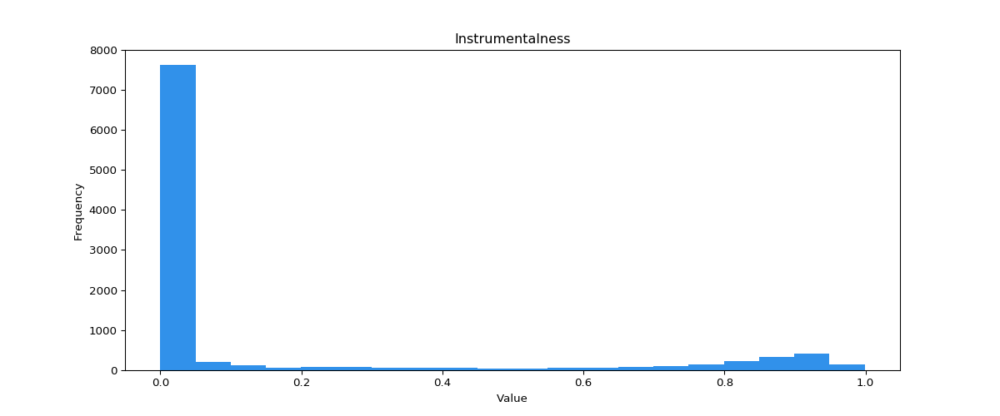
| `liveness` | 0.0 - 1.0 | Оценка присутсвия аудитории в записе трека или live-трек. Значения выше 0.8 отражают высокую вероятность этого. </br></br> 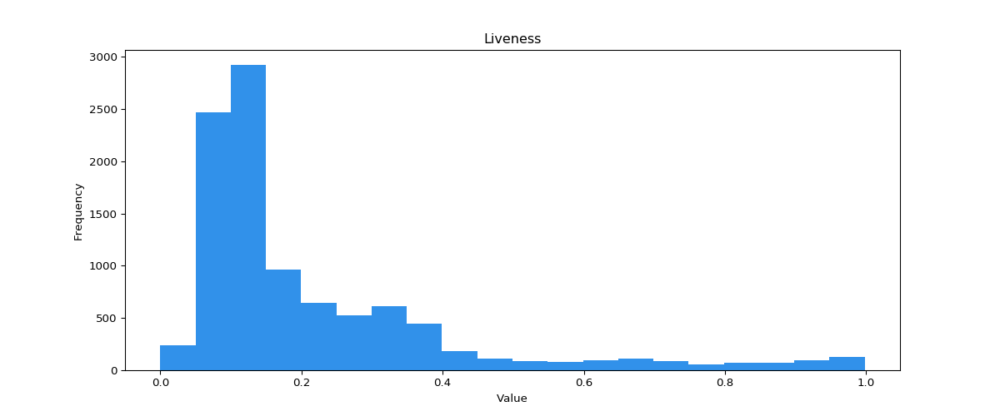
| `loudness` | -60 до 0 | Общая громкость в децибелах. Значение громкости усредняется по всему треку. Полезно при сравнении относительность громкости треков. Как правило, диапазон от -60 до 0 дБ. </br></br> 
| `speechiness` | 0.0 - 1.0 | Оценка количества произнесенных слов в треке. Значение близкое к 1.0 характеризует дорожку как ток-шоу, подкаст или аудио-книгу. Треки со значением выше 0.66 вероятно полностью состоят из слов. От 0.33 до 0.66 могут содержать как речь, так и музыку. Ниже 0.33 для музыки и треков без речи. </br></br> 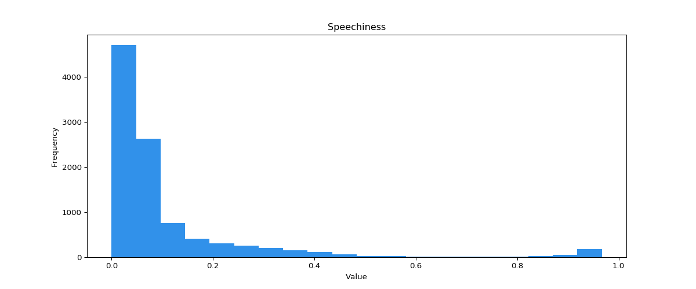
| `valence` | 0.0 - 1.0 | Оценка позитивности трека. Высокое значение говорит о более счастливом, веселом настроении. Низкое значение характерно для треков с грусным, депрессивным настроем. </br></br> 
| `tempo` | 30 - 210 | Общий темп трека из рассчета ударов в минуту (BPM). </br></br> 
| `key` | 0+ | Общий ключ трека. Значения подбираются исходя из [Pitch Class](https://en.wikipedia.org/wiki/Pitch_class). То есть 0 = C, 1 = C♯/D♭, 2 = D и так далее. Если ключ не установлен, значение -1.
| `mode` | 0 или 1 | Модальность трека. Мажор = 1, минор = 0.
| `time_signature` | 1+ | Общая оценка сигнатуры трека - условно обозначение для определения количества ударов в каждом такте. 

</br>

[Вернуться к списку функций](#полный-список-функций)

## Жанры для отбора рекомендаций

Данный перечень нужен только для [getRecomTracks](#sourcegetrecomtracksqueryobj). В [rangeTracks](#filterrangetrackstracks-args) можно использовать [такой перечень](http://everynoise.com/everynoise1d.cgi?scope=all).

```
a: acoustic, afrobeat, alt-rock, alternative, ambient, anime, 
b: black-metal, bluegrass, blues, bossanova, brazil, breakbeat, british, 
c: cantopop, chicago-house, children, chill, classical, club, comedy, country, 
d: dance, dancehall, death-metal, deep-house, detroit-techno, disco, disney, drum-and-bass, dub, dubstep, 
e: edm, electro, electronic, emo, 
f: folk, forro, french, funk, 
g: garage, german, gospel, goth, grindcore, groove, grunge, guitar, 
h: happy, hard-rock, hardcore, hardstyle, heavy-metal, hip-hop, holidays, honky-tonk, house, 
i: idm, indian, indie, indie-pop, industrial, iranian, 
j: j-dance, j-idol, j-pop, j-rock, jazz, 
k: k-pop, kids, 
l: latin, latino, 
m: malay, mandopop, metal, metal-misc, metalcore, minimal-techno, movies, mpb, 
n: new-age, new-release, 
o: opera, 
p: pagode, party, philippines-opm, piano, pop, pop-film, post-dubstep, power-pop, progressive-house, psych-rock, punk, punk-rock, 
r: r-n-b, rainy-day, reggae, reggaeton, road-trip, rock, rock-n-roll, rockabilly, romance, 
s: sad, salsa, samba, sertanejo, show-tunes, singer-songwriter, ska, sleep, songwriter, soul, soundtracks,
spanish, study, summer, swedish, synth-pop, 
t: tango, techno, trance, trip-hop, turkish, 
w: work-out, world-music
```

[Вернуться к списку функций](#полный-список-функций)
